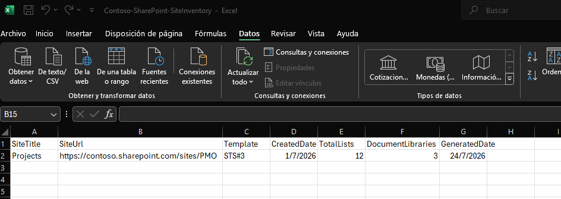

# Generate SharePoint Site Inventory Report

## Summary

This script generates a SharePoint Online site inventory report using PnP PowerShell.

The report collects key information from a SharePoint site, including:

- Site title
- Site URL
- Site template/type
- Creation date
- Number of lists
- Number of document libraries

The output is exported to a CSV file that can be used for documentation, governance reviews, or SharePoint environment assessments.



## Prerequisites

Before running the script:

- Install the latest version of PnP PowerShell:

powershell
Install-Module PnP.PowerShell -Scope CurrentUser


- The account running the script must have sufficient permissions to read the SharePoint site.

# [PnP PowerShell](#tab/pnpps)

```powershell
$AdminCenterURL="https://contoso-admin.sharepoint.com/"

##
.SYNOPSIS
Generates a SharePoint Online site inventory report.

.DESCRIPTION
Connects to a SharePoint Online site using PnP PowerShell and  
exports key site information including title, URL, template,  
creation date, lists and document libraries count.

.PARAMETER SiteUrl
URL of the SharePoint Online site.

.PARAMETER OutputFolder
Folder where the CSV report will be generated.

.EXAMPLE
.\Generate-SPSiteInventory.ps1 `
    -SiteUrl "https://contoso.sharepoint.com/sites/PMO"

.NOTES
Author: Antonio Villarruel
#>

param(
    [Parameter(Mandatory = $true)]
    [string]$SiteUrl,

    [string]$OutputFolder = "."
)

Write-Host "Connecting to SharePoint site..." -ForegroundColor Cyan

try {
    Connect-PnPOnline -Url $SiteUrl -Interactive
}
catch {
    Write-Error "Unable to connect to the SharePoint site."
    exit
}

Write-Host "Retrieving site information..." -ForegroundColor Cyan

try {
    $web = Get-PnPWeb -Includes Title, Url, WebTemplate, Created
    $lists = Get-PnPList
    $libraries = $lists | Where-Object {
        $_.BaseTemplate -eq 101
    }

    $inventory = [PSCustomObject]@{
        SiteTitle         = $web.Title
        SiteUrl           = $web.Url
        Template          = $web.WebTemplate
        CreatedDate       = $web.Created
        TotalLists        = $lists.Count
        DocumentLibraries = $libraries.Count
        GeneratedDate     = Get-Date
    }

    if (!(Test-Path $OutputFolder)) {
        New-Item -ItemType Directory -Path $OutputFolder | Out-Null
    }

    $outputFile = Join-Path `
        $OutputFolder `
        "SharePointSiteInventory.csv"

    # Export inventory report to CSV
    $inventory | Export-Csv `
        -Path $outputFile `
        -NoTypeInformation `
        -Encoding UTF8

    Write-Host ""
    Write-Host "Inventory generated successfully!" -ForegroundColor Green
    Write-Host "File: $outputFile"
}
catch {
    Write-Error "Error generating inventory report."
}

```

[!INCLUDE [More about PnP PowerShell](../../docfx/includes/MORE-PNPPS.md)]

---

## Contributors

| Author(s) |
|-----------|
| [Antonio Villarruel](https://github.com/a-villarruel) |

[!INCLUDE [DISCLAIMER](../../docfx/includes/DISCLAIMER.md)]


