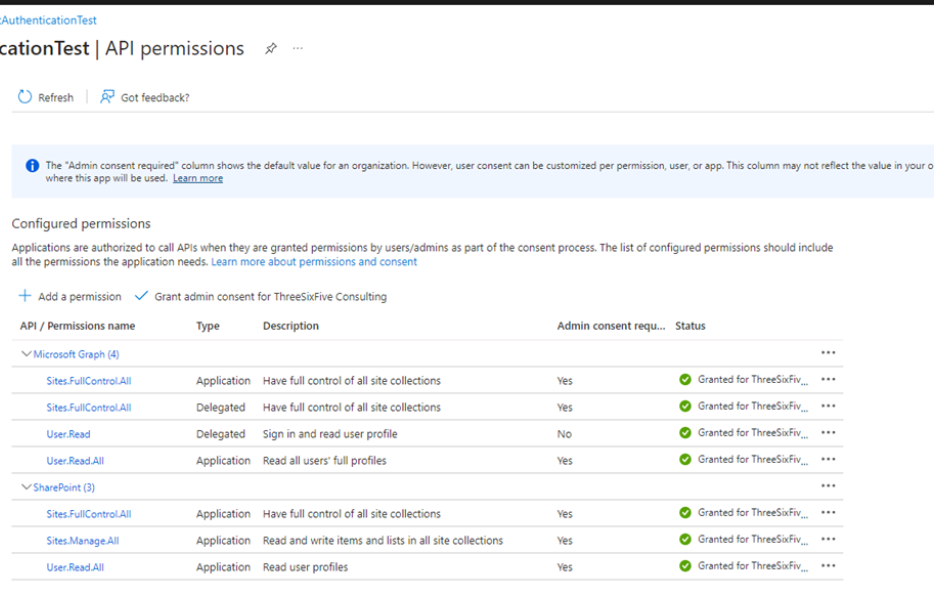
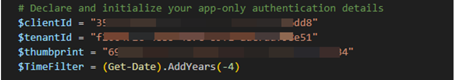
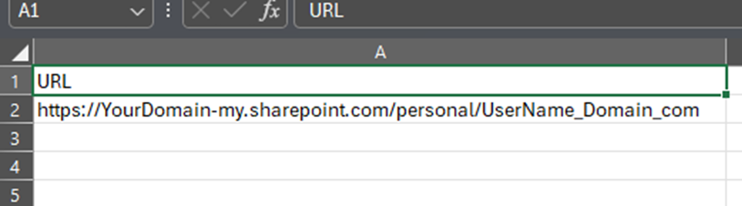
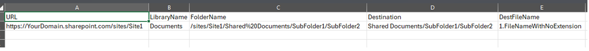

# M365 Consultant's Script Kit

## Summary

These scripts are part of the Microsoft 365 Consultant's Script kit, created by Nick Brattoli and Three Six Five Consulting.

We have created three scripts to provide SharePoint and OneDrive users reports of any files that have not been modified in 4 years or longer. 

The three scripts are as follows:
 - 1.OneDrive Scan.ps1
	 - Read OneDrive URLS from a csv file
	 - Scan each OneDrive url one-at-a time for files that haven’t been modified in more than 4 years
	 - Create a report called “1.OneDrive File Report <OneDriveURL>-<Timestamp>.xlsx and upload it to the same library that was just scanned
 - 2.SPSiteScan.ps1
	 - Read SharePoint site urls from a csv file
	 - Scan every file inside every library that hasn’t been modified in more than 4 years
	 - Create a report for each library in that site called “1.File Report - <Library Title>- <Timestamp>.xlsx” and upload the report to the document library that was scanned
 - 3.CustomSPSiteScan
	- Read SharePoint site url, specified document library, specified folder (optional), report name, and report location from a csv file
	- Scan the specific folders in the specific libraries on the specific sites from the csv file to get files older than 4 years
	- Create a report with the specific name in the csv file and upload it to the specified SharePoint location

  ##  Pre-requisites
Several things must be configured or installed ahead of time
	An App registration with a certificate and appropriate permissions has to be created in Azure
	That certificate must be installed on any machine that will run the scripts
	PowerShell 7 must be installed
	The following PowerShell modules are needed:
	PnP.PowerShell
	ImportExcel
## Setup
Each of these scripts runs off of a csv file that you must fill out before running. You also have to configure the scripts themselves. See below for more details.

### All Scripts
This script uses an Azure App registration for authentication. You must create the registration with certificate to get the client ID, tenantID, and certificate thumbprint. You should also make sure that app has sufficient permissions. These are the ones I used:



Every script needs to have the authentication setup in order to function. To do this, edit each script in your editor of choice (Visual Studio Code preferred). At the top of the script, you will see all of the options you should configure:


	
Client ID and Tenant ID are associated to the app registration and should only need to be set once for each environment. 

Thumbprint is the certificate thumbprint. If the certificate is changed, you will have to install the new one on the machine running the scripts, and also change the thumbprint to match

Time Filter is just what it sounds like. If you want to increase or decrease the time, you can change it here. You can even change “AddYears” to “AddMonths” or “AddDays.” Make sure the number stays negative.

### OneDrive

Fill out the OneDriveURLs.CSV file with the URL of the OneDrive user you wish to scan


### Entire SharePoint Sites

Fill out the Script2SPURLs.csv file with the URLs for all the SharePoint sites you wish to scan. Make sure you use the complete path!

### Single document library and folder
1.	Open customSPURLs.csv
2.	Add the URL for every site you wish to scan
3.	Add the library name for the title of the library you are scanning
4.	Add the entire path of the folder name you are scanning
5.	Add the relative path of the library and folder where you want to place the report
6.	Add the file name without extension for the name of the report you are creating



## Running the Scripts

Now that the scripts are setup, you just need to run them. All these steps are the same, just change the name of the script.
1.	Open PowerShell 7 (as administrator recommended)
2.	Type CD “<whatever the path is where these scripts are>”
3.	Start typing the name of the script you want to run, and hit tab until it shows up. For example, type the number 1, and hit tab twice so it looks like this, complete with the “.\” 

4.	Hit enter and the script will run
5.	Do the same thing with script 2 and 3 if you wish


## 1. OneDrive Scan

# [PnP PowerShell](#tab/pnpps)
```powershell

# Declare and initialize your app-only authentication details
$clientId = "XXXX"
$tenantId = "XXXX"
$thumbprint = "XXXX"
$TimeFilter = (Get-Date).AddYears(-4)


# Initialize audit log
$auditLog = @()
$timestamp = Get-Date -Format "MMddyyyyHHmmss"


Start-Transcript -Append ".\logs\OneDrive $timestamp log.txt"


try {
    # Import CSV with OneDrive URLs
    Write-host "Starting Script at - $timestamp"
    $urls = Import-Csv -Path "<Path>\OneDriveURLs.csv"
    Write-Host "csv imported, starting process" -ForegroundColor green
    foreach ($url in $urls) {
        # Try to establish a connection
    Connect-PnPOnline -Url $url.URL -ClientId $clientId -Thumbprint $thumbprint -Tenant $tenantId -ErrorAction Stop
     
        $timestamp = Get-Date -Format "MMddyyyyHHmmss"        
        Write-Host "connection to $url successful at $timestamp" -ForegroundColor Green
        
            
$timestamp = Get-Date -Format "MMddyyyyHHmmss"
Write-Host "starting to get items at $timestamp"
          $items = Get-PnPListItem -List "Documents" -PageSize 1000 -ErrorAction Stop | Where {$_["Modified"] -Lt $TimeFilter}
           #$items = Get-PnPListItem -List "Documents" -Query $camlQuery 
           $itemcount = $items.count 
           write-host "found $itemcount items."
            $timestamp = Get-Date -Format "MMddyyyyHHmmss"
            write-host "items done scanning at $timestamp"
            Write-host "iterating through items and organizing. Please wait." -ForegroundColor green
            $result = @()

            foreach ($item in $Items) {
                $result += [PSCustomObject]@{
                    "FilePath"        = $item["FileDirRef"]
                    "FileName"        = $item["FileLeafRef"]
                    "LastModified"    = $item["Modified"]
                    "CreatedBy"       = $item["Author"].LookupValue
                    "ModifiedBy"      = $item["Editor"].LookupValue
                    "Created"         = $item["Created"]
                    "Size"            = $item["File_x0020_Size"]
                    "RetentionLabel"  = $item["ComplianceAssetId"]
                }
            }
            $timestamp = Get-Date -Format "MMddyyyyHHmmss"
            # Assuming $result is a collection of all your objects
            # Sort the results first by FilePath, then by LastModified
            $sortedResults = $result | Sort-Object -Property FilePath, LastModified

            Write-Host "Items iterated through at $timestamp" -ForegroundColor Green
            
            # Extract username from OneDrive URL
            $userName = $url.URL -replace '.*?/personal/', ''
            Write-Host "username is $userName"
            # Export to XLSX (locally)
            write-host "exporting to Excel"
            $localExportFullPath = ".\1.OneDrive Reports\1.OneDrive File Report $userName - $timestamp.xlsx"
            $sortedresults | Export-Excel -Path $localExportFullPath
            Write-Host "File exported to temp location" -ForegroundColor green

            # Upload the file to OneDrive
            Add-PnPFile -Path $localExportFullPath -Folder "Documents" -ErrorAction Stop
            Write-Host "File uploaded to OneDrive" -ForegroundColor Green
            $timestamp = Get-Date -Format "MMddyyyyHHmmss"
            write-host "User completed at $timestamp"
            # Add entry to audit log
            #$auditLog += "Processed OneDrive URL: $($url.URL) at $(Get-Date -Format 'yyyy-MM-dd HH:mm:ss')"
        #}
    }
} catch {
    Write-Host "An error occurred: $_"
}


stop-Transcript

```
[!INCLUDE [More about PnP PowerShell](../../docfx/includes/MORE-PNPPS.md)]
***

## 2. SP Site Scan

# [PnP PowerShell](#tab/pnpps2)

```powershell
# Declare and initialize your app-only authentication details
$clientId = "xxxxxx"
$tenantId = "xxxxx"
$thumbprint = "xxxxxx"
$TimeFilter = (Get-Date).AddYears(-4)

# Initialize audit log
$auditLog = @()
$timestamp = Get-Date -Format "MMddyyyyHHmmss"


Start-Transcript -Append ".\logs\SharePoint Scan- $timestamp log.txt" -UseMinimalHeader -IncludeInvocationHeader

try {
    # Import CSV with SharePoint Site URLs
    $urls = Import-Csv -Path "<Path>\Script2SPURLs.csv"
    Write-Host "csv imported, starting process" -ForegroundColor green
    foreach ($url in $urls) {
        $timestamp = Get-Date -Format "MMddyyyyHHmmss"
        Connect-PnPOnline -Url $url.URL -ClientId $clientId -Thumbprint $thumbprint -Tenant $tenantId -ErrorAction Stop
        Write-Host "connected to site: $url at $timestamp" -ForegroundColor green
        Write-host "getting libraries" -ForegroundColor yellow
        $libs = Get-PnPList | Where-Object { $_.BaseType -eq "DocumentLibrary" }  # Get only document libraries
        Write-Host "libraries found, starting scans" -ForegroundColor yellow
       
        foreach ($lib in $libs) {
            
            #if ($lib.RootFolder.ServerRelativeUrl -notlike "*_catalogs/hubsite*") {
            if (-Not $lib.Hidden -And $lib.BaseTemplate -Ne 115 -And $lib.Title -Ne 'Style Library'){
                $libTitle = $lib.Title
                $timestamp = Get-Date -Format "MMddyyyyHHmmss"
            Write-Host "Starting $libTitle at $timestamp " -ForegroundColor Blue | Format-List *
                       
            $items = Get-PnPListItem -List $lib.Title -PageSize 1000 -ErrorAction Stop | Where {$_["Modified"] -Lt $TimeFilter}
            $timestamp = Get-Date -Format "MMddyyyyHHmmss"
            Write-Host "items finished scanning at $timestamp, creating table" -ForegroundColor green
            $result = @()

            foreach ($item in $items) {
                $result += [PSCustomObject]@{
                    "FilePath"        = $item["FileDirRef"]
                    "FileName"        = $item["FileLeafRef"]
                    "LastModified"    = $item["Modified"]
                    "CreatedBy"       = $item["Author"].LookupValue
                    "ModifiedBy"      = $item["Editor"].LookupValue
                    "Created"         = $item["Created"]
                    "Size"            = $item["File_x0020_Size"]
                    "RetentionLabel"  = $item["ComplianceAssetId"]
                }
            }
            $timestamp = Get-Date -Format "MMddyyyyHHmmss"

            # Assuming $result is a collection of all your objects
            # Sort the results first by FilePath, then by LastModified
            $sortedResults = $result | Sort-Object -Property FilePath, LastModified

            Write-host "items placed in table at $timestamp, preparing to export" -ForegroundColor Green
            $localExportFullPath = ".\2.SharePoint Reports\1.File Report - $libTitle - $timestamp.xlsx"
            $sortedresults | Export-Excel -Path $localExportFullPath
            write-host "Local export complete, uploading to document library" -ForegroundColor Green
            $folderUrl = $lib.RootFolder.ServerRelativeUrl.Trim()
            write-host "uploading to $folderURL" -ForegroundColor Yellow
            Add-PnPFile -Path $localExportFullPath -Folder "$folderUrl" -ErrorAction Stop
            Write-host 'file uploaded, starting next library'
            }}
            $timestamp = Get-Date -Format "MMddyyyyHHmmss"
        Write-host "Site complete at $timestamp, starting next site or ending" -ForegroundColor green
    }
} catch {
    Write-Host "An error occurred: $_"
}

Stop-Transcript

```
[!INCLUDE [More about PnP PowerShell](../../docfx/includes/MORE-PNPPS.md)]
***

## 3. Individual library and folder Scan

# [PnP PowerShell](#tab/pnpps3)
```powershell
# Declare and initialize your app-only authentication details
$clientId = "xxxxx"
$tenantId = "xxxxx"
$thumbprint = "xxxx"
$TimeFilter = (Get-Date).AddYears(-4)

# Initialize audit log
$auditLog = @()
$timestamp = Get-Date -Format "MMddyyyyHHmmss"


Start-Transcript -Append ".\logs\SharePoint Custom Scan- $timestamp log.txt" -UseMinimalHeader -IncludeInvocationHeader

try {
    # Import CSV with SharePoint Site URLs
    $urls = Import-Csv -Path "<Path>\CustomSPUrls.csv"
    Write-Host "csv imported, starting process" -ForegroundColor green
    foreach ($url in $urls) {
        $timestamp = Get-Date -Format "MMddyyyyHHmmss"
        Connect-PnPOnline -Url $url.URL -ClientId $clientId -Thumbprint $thumbprint -Tenant $tenantId -ErrorAction Stop
        Write-Host "connected to site: $url at $timestamp" -ForegroundColor green
        Write-host "getting libraries" -ForegroundColor yellow
        $lib = $url.LibraryName  # Get specific document library
        Write-Host "starting scans" -ForegroundColor yellow
        $ScanFolder = $url.FolderName
        write-host "scanning $ScanFolder"
        $timestamp = Get-Date -Format "MMddyyyyHHmmss"
        Write-Host "Starting $lib at $timestamp " -ForegroundColor Blue | Format-List *
                       
            $items = Get-PnPListItem -List $lib -folderServerRelativeURL $ScanFolder -PageSize 1000 -ErrorAction Stop | Where {$_["Modified"] -Lt $TimeFilter}
            $timestamp = Get-Date -Format "MMddyyyyHHmmss"
            Write-Host "items finished scanning at $timestamp, creating table" -ForegroundColor green
            $result = @()

            foreach ($item in $items) {
                $result += [PSCustomObject]@{
                    "FilePath"        = $item["FileDirRef"]
                    "FileName"        = $item["FileLeafRef"]
                    "LastModified"    = $item["Modified"]
                    "CreatedBy"       = $item["Author"].LookupValue
                    "ModifiedBy"      = $item["Editor"].LookupValue
                    "Created"         = $item["Created"]
                    "Size"            = $item["File_x0020_Size"]
                    "RetentionLabel"  = $item["ComplianceAssetId"]
                }
            }
            # Assuming $result is a collection of all your objects
            # Sort the results first by FilePath, then by LastModified
            $sortedResults = $result | Sort-Object -Property FilePath, LastModified

            $timestamp = Get-Date -Format "MMddyyyyHHmmss"
            Write-host "items placed in table at $timestamp, preparing to export" -ForegroundColor Green
            $ReportFileName = $url.DestFileName
            $localExportFullPath = ".\2.SharePoint Reports\$ReportFileName - $timestamp.xlsx"
            $sortedresults | Export-Excel -Path $localExportFullPath
            write-host "Local export complete, uploading to document library" -ForegroundColor Green
            $DestFolder = $url.Destination
            write-host "uploading to $DestFolder" -ForegroundColor Yellow
            Add-PnPFile -Path $localExportFullPath -Folder "$DestFolder" -ErrorAction Stop
            Write-host 'file uploaded!' -ForegroundColor green
            $timestamp = Get-Date -Format "MMddyyyyHHmmss"
            Write-host "Site complete at $timestamp, starting next site or ending" -ForegroundColor green
        }
        
    
} catch {
    Write-Host "An error occurred: $_"
}

Stop-Transcript
```
[!INCLUDE [More about PnP PowerShell](../../docfx/includes/MORE-PNPPS.md)]
***

## Contributors

| Author(s) |
|-----------|
| Nick Brattoli|


[!INCLUDE [DISCLAIMER](../../docfx/includes/DISCLAIMER.md)]

