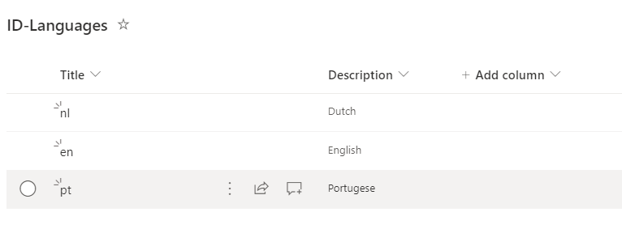
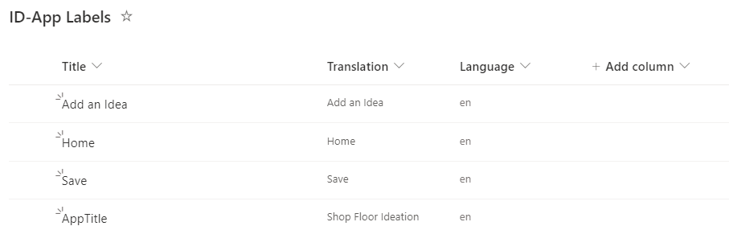
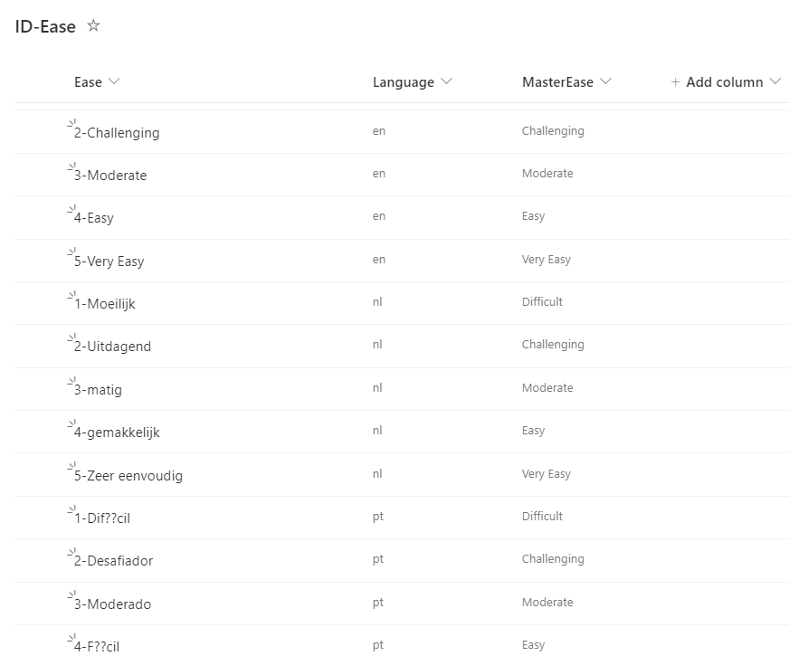

# Translate columns in a SharePoint list

## Summary

Say we have PowerApp that is storing its data in SharePoint lists. We want to make the app multilingual so we Add a new list with the languages we want to support called ID_Languages:


We then add a Radio control to our list to let the user select a language. We set the onChange of the control to :
Set(gvLanguage,Radio1.Selected.Title);

So now we have the selected language in gvLanguage.

Next we want to change all the labels in the app to display the translated text of the label. So we create a table called ID-App Labels



The Title field is what we use in code to find the correct label (If you're using forms make it the same as the name of the field). The Language is a lookup column pointing back to our ID-Languages list. The Translation column is the translated version of that label. We just add the values for our native language for now.

We add the following to the OnSelect of the Language Radio control to get all the labels for the selected language:
Set(
    gvLabels,
    Filter(
        'ID-App Labels',
        Language.Value = gvLanguage
    )
);


Now, whenever we want to add literal text to our PowerApp , instead of typing in the text we use the formula
First(
    Filter(
        gvLabels,
        Title = "AppTitle"
    )
).Translation

Next for any dropdown lists we create a new list to hold the translated values. For example here is a list (ID-Ease) used in dropdowns:


Again we only add the values for our native language now. Again the Language column is a lookup to our Languages list. The MasterEase column is a lookup to a master list of Ease values. For a single lookup value, all the translations must point back to the same master record for reporting purposes(That's not important for this sample though).

Now , when we want to display the "Ease" is a Dropdown or ComboBox we set the items to 

Filter('ID-Ease',Language.Value=gvLanguage)

Now for the scripting part. We get everything developed and working in our native language and we want to add the
translations for all the other languages in or ID-Languages list.


# [PnP PowerShell](#tab/pnpps)

```powershell
Connect-PnPOnline "https://tenant.sharepoint.com/sites/ShopFloorIdeation/" -DeviceLogin
function Translate-List {
    param (
        [string]$ListId, ## the ID or Title of the list to translate
        [string[]]$ColumnsToTranslate, ## the names of the columns to translate
        [string[]]$ColumnsToCopy, ## the names of the columns to copy without translating
        [string]$LanguageColumnName, ## the name of the Language column (must be a lookup)
        [string]$FromLanguage, ## the language we are translating from (items in the list must be of this lanugage)
        [string]$LanguageList ## the ID or Title of the List of languages
    )
    $endpoint = "https://api.cognitive.microsofttranslator.com/"
    $subscriptionkey = "YOURKEY"
    $headers = @{"Ocp-Apim-Subscription-Key" = $subscriptionkey; "Content-Type" = "application/json"; } 
    ##1. Sanity check
    $list = get-pnpList -Identity $ListId
    $fields = Get-PNPField -List $list
    if ($null -eq $list) {
        Write-Error "List $listId not found"
        return;
    }
    foreach ($col in $ColumnsToCopy) {
        $field = $Fields.Where({ $_.InternalName -eq $col }) 
        if (0 -eq $field.Count) {
            Write-Error "Field $col not found in list $listId"
            return;
        }
        $fieldType = $field.FieldTypeKind
        if ($fieldType -ne "Lookup" -and $fieldType -ne "Text") {
            Write-Error "Cannot copy field $col of type  $fieldType"
            return;
        }
    }
    foreach ($col in $ColumnsToTranslate) {
        $field = $Fields.Where({ $_.InternalName -eq $col }) 
        if (0 -eq $field.Count) {
            Write-Error "Field $col not found in list $listId"
            return;
        }
        $fieldType = $field.FieldTypeKind
        if ($fieldType -ne "Text") {
            Write-Error "Cannot translate field $col of type  $fieldType"
            return;
        }
    }

    ##2. Remove old items
    
    $items = (Get-PnPListItem -List $list -PageSize 10000)
    $deletebatch = new-PnPBatch
    foreach ($item in $items) {
        If ($item.FieldValues[$LanguageColumnName].LookupValue -ne $FromLanguage) {
            Remove-PnPListItem -List $list -Identity $item.Id -Batch $deletebatch -Recycle
        }
        if ($deletebatch.RequestCount -eq 100) {
            Invoke-PnpBatch $deletebatch
            $deletebatch = new-PnPBatch
        }
    }
    if ($deletebatch.RequestCount -gt 0) {
        Invoke-PnpBatch $deletebatch
    }
    ##3. Add back translations

    $items = (Get-PnPListItem -List $list -PageSize 10000)
    $languages = (Get-PnPListItem -List (get-pnpList -Identity "ID-Languages") -PageSize 10000)
    
    foreach ($language in $languages | Where-Object { $_.FieldValues["Title"] -ne $FromLanguage }) {
        $route = "/translate?api-version=3.0&from=$FromLanguage&to=" + $language.FieldValues["Title"]
        $uri = "$endpoint$route"
        foreach ($item in $items) {
            $updates = @{
                $LanguageColumnName = $language.FieldValues["ID"]
            }
            foreach ($col in $ColumnsToCopy) {
                $field = $Fields.Where({ $_.InternalName -eq $col }) 
                $fieldType = $field.FieldTypeKind
                switch ($fieldType) {
                    "Lookup" { 
                        $updates[$col] = $item[$col].LookupId
                    }
                    "Text" { 
                        $updates[$col] = $item[$col]
                    }
                    Default {
                        Write-Host "Cannot copy field $col of type  $fieldType"
                    }
                }
            }
            foreach ($ColumnToTranslate in $ColumnsToTranslate) {
                if ($null -eq $item.FieldValues[$ColumnToTranslate] ) {
                    $updates[$ColumnToTranslate] = $null
                }
                else {
                    $body = @(
                        @{
                            "Text" = $item.FieldValues[$ColumnToTranslate]
                        })
                    $body = ConvertTo-Json $body
                    $response = Invoke-WebRequest -Uri $uri -Body $body  -Headers $headers -Method Post
                    $xlat = $response | ConvertFrom-Json
                    if ($xlat.translations.text.Length -lt 256) {
                        $translation = $xlat.translations.text
                    }
                    else {
                        $translation = $xlat.translations.text.Substring(0, 255)
                    }
                    $updates[$ColumnToTranslate] = $translation
                }    
            }
            $newItem = Add-PnPListItem -List $list  -Values $updates
        }
    }
    return 
}
Translate-List -ListId "ID-App Labels" -ColumnsToTranslate @("Translation")  -ColumnsToCopy @("Title") -LanguageColumnName "Language" -FromLanguage "en" -LanguageList "ID-Languages"
Translate-List -ListId "ID-Ease" -ColumnsToTranslate @("Title")  -ColumnsToCopy @("MasterEase") -LanguageColumnName "Language" -FromLanguage "en" -LanguageList "ID-Languages"

```
[!INCLUDE [More about PnP PowerShell](../../docfx/includes/MORE-PNPPS.md)]

After running the script the translated values have been added to your ID-App Labels and ID-Ease lists:




If you add new items to any of the lists the script can be rerun and it will re-translate everything.

To run the script you will need to get a key for Azure translation services as described at https://docs.microsoft.com/en-us/azure/cognitive-services/translator/translator-how-to-signup. Your key should be place in the variable $subscriptionkey 

> [!Note]
> The translations done using machine translation services should be reviewed by someone who speaks both languages. The are sometime incorrect.


***

## Contributors

| Author(s) |
|-----------|
| Russell Gove |

[!INCLUDE [DISCLAIMER](../../docfx/includes/DISCLAIMER.md)]

