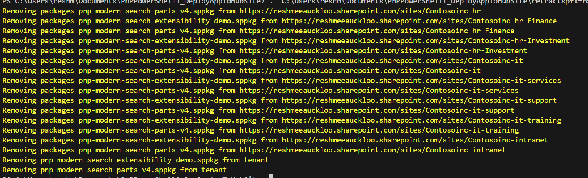

# Retracting SPFx Solutions from Hub Site and associated sites

## Summary

At the time of submitting this script sample there is no concept of a hub site app catalog. However you may want to install or upgrade or uninstall a SPFx solution to all sites within a hub for example all sites linked to the intranet hub.  There is a script that covers deploying SPFx across all sites in a hub using the tenant app catalog. [Deploys and Installs SharePoint Framework (SPFx) solutions to Hub Site and Associated Sites using the tenant app catalog](../spo-deploy-install-update-spfx-hubsiteassociatedsites-tenantappcatalog/README.md). This sample covers how to uninstall SPFx package across hub site and associated sites from the tenant app catalogue. 



### Prerequisites

- The user account that runs the script must have SharePoint Online tenant administrator access.

- Before running the script, edit the script and update the variable values in the Config Variables section, such as Admin Center URL, Hub Site URL, the CSV output file path and alternatively the sppkg packages Folder. 

This script snippet automates the removal of SPFx packages across associated sites of a hub site, leveraging the tenant-level app catalog. It navigates through each associated site, checks for existing packages and uninstalls them. 

# [PnP PowerShell](#tab/pnpps)

```powershell
$AdminCenterURL="https://contoso-admin.sharepoint.com"
$tenantAppCatalogUrl = "https://contoso.sharepoint.com/sites/apps"
$hubSiteUrl = "https://contoso.sharepoint.com/sites/Contosoinc-intranet"
$dateTime = (Get-Date).toString("dd-MM-yyyy")
$invocation = (Get-Variable MyInvocation).Value
$directorypath = Split-Path $invocation.MyCommand.Path
$fileName = "\Log_Tenant_Removing_Solution" + $dateTime + ".csv"
$OutPutView = $directorypath + $fileName
 
$sppkgFolder = "./packages"
 
cd $PSScriptRoot
$packageFiles = Get-ChildItem $sppkgFolder
 
Connect-PnPOnline $tenantAppCatalogUrl -Interactive
$appCatConnection  = Get-PnPConnection
 
Connect-PnPOnline $AdminCenterURL -Interactive
$adminConnection  = Get-PnPConnection
 
$SiteAppUpdateCollection = @()

$associatedSites = Get-PnPHubSiteChild -Identity $hubSiteUrl -Connection $adminConnection
$associatedSites += $hubSiteUrl #Add the hub site to the list of associated sites
#Get all site collections associated with the hub site
$associatedSites | ForEach-Object {
    $Site = Get-PnPTenantSite $_ -Connection $adminConnection
     Connect-PnPOnline -Url $Site.url -Interactive
     $siteConnection  = Get-PnPConnection
       foreach($package in $packageFiles)
       {
          $packageName = $package.PSChildName    
           #Find Name of app from installed package
           $RestMethodUrl = '/_api/web/lists/getbytitle(''Apps%20for%20SharePoint'')/items?$select=Title,LinkFilename'
           $apps = (Invoke-PnPSPRestMethod -Url $RestMethodUrl -Method Get -Connection $appCatConnection).Value
           $appTitle = ($apps | where-object {$_.LinkFilename -eq $packageName} | Select-Object Title).Title
        
           $currentPackage = Get-PnPApp -Identity $appTitle -scope Tenant
#check is app is installed on site
           $web = Get-PnPWeb -Includes AppTiles -Connection $siteConnection
           $app = $web.AppTiles  |  where-object {$_.Title -eq $currentPackage.Title }
        if($app)
        {
          Write-Host "Removing packages $packageName from $($Site.url)" -ForegroundColor Yellow     
          Uninstall-PnPApp -Identity $currentPackage.Id -Connection $siteConnection
            $ExportVw = New-Object PSObject
            $ExportVw | Add-Member -MemberType NoteProperty -name "Site URL" -value $Site.url  
            $ExportVw | Add-Member -MemberType NoteProperty -name "Package Name" -value $packageName
        }
        $SiteAppUpdateCollection += $ExportVw     
      }     
  }

foreach($package in $packageFiles)
{
  $packageName = $package.PSChildName
   Write-Host "Removing $packageName from tenant" -ForegroundColor Yellow
   $RestMethodUrl = '/_api/web/lists/getbytitle(''Apps%20for%20SharePoint'')/items?$select=Title,LinkFilename'
   $apps = (Invoke-PnPSPRestMethod -Url $RestMethodUrl -Method Get -Connection $appCatConnection).Value
   $appTitle = ($apps | where-object {$_.LinkFilename -eq $packageName} | select Title).Title
   Remove-PnPApp -Identity $appTitle -Scope Tenant
}
#Export the result Array to CSV file
$SiteAppUpdateCollection | Export-CSV $OutPutView -Force -NoTypeInformation
 
Disconnect-PnPOnline
```

> [!Note]
> SharePoint admin rights are required to run the script

[!INCLUDE [More about PnP PowerShell](../../docfx/includes/MORE-PNPPS.md)]

***

## Source Credit

Sample first appeared on [Retracting SPFx Solutions from Tenant Sites using PnP PowerShell](https://reshmeeauckloo.com/posts/powershell-retract-spfx-from-sites-tenant/)

## Contributors

| Author(s) |
|-----------|
| [Reshmee Auckloo](https://github.com/reshmee011) |


[!INCLUDE [DISCLAIMER](../../docfx/includes/DISCLAIMER.md)]

