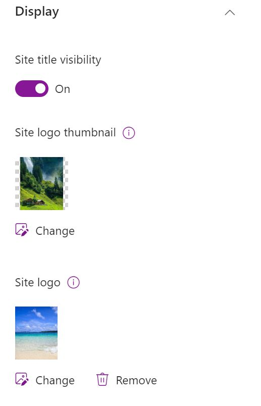

# Updates SharePoint Site Logo and Thumbnail

## Summary

In SharePoint Online sites, the distinction between the `Site Logo` and `Site Thumbnail` is crucial. The site logo appears in the site header, while the site thumbnail is used in search results, site cards, file copying/moving, and other areas.

Both site logo and thumbnail are part of SharePoint branding. This post covers how to update the site logo and thumbnail across multiple SharePoint sites within a hub using PowerShell.

I used the script to update site logo and thumbnail for associated sites within a hub site which could be an intranet if there are no valid site logo and thumbnail already on the site.



### Prerequisites

- The user account that runs the script must have access to the SharePoint Online site.

Please update the variables before running the script
 * $AdminCenterURL= sharepoint centre url
 * $tenantUrl = tenant url
 * $hubSiteUrl = hub site url
 * $logoLocalPath : path of the logo file
 * $thumbnailLocalPath = path of the thumbnail file


# [PnP PowerShell](#tab/pnpps)

```powershell
$AdminCenterURL="https://contoso-admin.sharepoint.com"
$tenantUrl = "https://contoso.sharepoint.com"
$hubSiteUrl = "https://contoso.sharepoint.com"

$logoLocalPath = (Get-Location).Path + '\Logo\logo white 1280x1280.png'
$thumbnailLocalPath = (Get-Location).Path + '\Logo\thumbnail white 1280x1280.png'

Connect-PnPOnline -Url $AdminCenterURL -Interactive
 
$logoLocalPath = (Get-Location).Path + '\Logo\logo white 1280x1280.png'
$thumbnailLocalPath = (Get-Location).Path + '\Logo\thumbnail white 1280x1280.png'
 
$m365Sites = Get-PnPHubSiteChild -Identity $hubSiteUrl

Start-Transcript
 
$m365Sites | ForEach-Object {
    Connect-PnPOnline -Url $_ -Interactive
    $logoFile = '__rectSitelogo__contoso-logo.png'
    $thumbnailFile = 'thumbnail.png'

    $logoRelativePath = $_.replace($tenantUrl, "") + "/SiteAssets/" + $logoFile
    $thumbnailRelativePath = $_.replace($tenantUrl, "") + "/SiteAssets/" + $logoFile

    $logoAslistItem =  Get-PnPFile -Url $logoRelativePath -AsListItem
    $thumbnailAslistItem =  Get-PnPFile -Url $thumbnailRelativePath -AsListItem
 
    if(!$logoAslistItem){
      Add-PnPFile -Path $logoLocalPath -Folder 'SiteAssets' -NewFileName $logoFile | Out-Null
    }
    
    if(!$thumbnailAslistItem){
      Add-PnPFile -Path $thumbnailLocalPath -Folder 'SiteAssets' -NewFileName $thumbnailFile | Out-Null
    }
 
    Set-PnPWebHeader -SiteLogoUrl $logoRelativePath -SiteThumbnailUrl $thumbnailRelativePath
}
Stop-Transcript
```

[!INCLUDE [More about PnP PowerShell](../../docfx/includes/MORE-PNPPS.md)]

***

## Source Credit

Sample first appeared on [Deletion of sharing links with PowerShell](https://reshmeeauckloo.com/posts/powershell-update-site-header-sitelogo-thumbnail/)

## Contributors

| Author(s) |
|-----------|
| [Reshmee Auckloo](https://github.com/reshmee011) |


[!INCLUDE [DISCLAIMER](../../docfx/includes/DISCLAIMER.md)]

