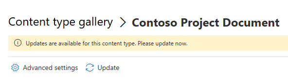

# Update Content type from Hub on sites

## Summary

Back in the days Microsoft would update the content types in the content type hub and then push it to all site collections. This is no longer the case. You need to run a script to update the content types in all site collections.
This is such a script. It will check all site collections and update the content type if it exists.





# [PnP PowerShell](#tab/pnpps)

```powershell

#when a content type in the Content type gallery is updated and republished
# it is not automaticly updated on the site collections where it is used.

# This script will check every site collection and update the content type

$adminUrl = "https://contoso-admin.sharepoint.com/"
$pnpClientId = "the client id of the PnP Rocks app"
$contenttypeName = "Contoso Project Document"

if(-not $conn)
{
    $conn = Connect-PnPOnline -Url $adminUrl -Interactive -ClientId $pnpClientId -ReturnConnection -WarningAction Ignore
}

$allsites = Get-PnPTenantSite -Connection $conn -ErrorAction Stop
foreach($site in $allsites)
{
    Write-Host "Site: $($site.Url)"
    try 
    {
        $siteUrl = $site.Url
        Connect-PnPOnline -Url $siteUrl -Interactive -ClientId $pnpClientId  -WarningAction Ignore
        $contenttype = Get-PnPContentType -ErrorAction SilentlyContinue -Identity $contenttypeName 
        if($contenttype)
        {
                Write-Host "Updating content type: $($contenttype.Name) at site: $siteUrl " -ForegroundColor Green
                Add-PnPContentTypesFromContentTypeHub -ContentTypes $contenttype.Id  -ErrorAction Stop
        }
        else
        {
            Write-Host "No content type: $($contenttype.Name) at site: $siteUrl " 
        }   
    }
    catch 
    {
            <#Do this if a terminating exception happens#>
            throw $_
    }
}


```
[!INCLUDE [More about PnP PowerShell](../../docfx/includes/MORE-PNPPS.md)]
***


## Contributors

| Author(s) |
|-----------|
| Kasper Larsen |

[!INCLUDE [DISCLAIMER](../../docfx/includes/DISCLAIMER.md)]

