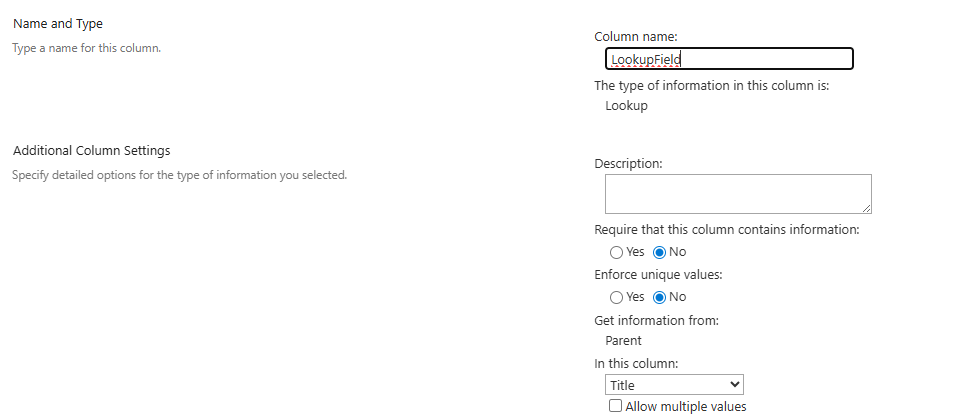

# Update Lookup Field

## Summary

This PowerShell script enhances SharePoint Online list management by updating a lookup column in a list to reference a lookup list. Using PnP PowerShell, it modifies the lookup column’s schema XML to set or update the List, WebId, ShowField. The script allows users to specify the primary display field (via ShowFieldName, e.g., Title, ID).



# [PnP PowerShell](#tab/pnpps)

```powershell
<#
.SYNOPSIS
    Updates a SharePoint Online lookup column to reference a lookup list
.DESCRIPTION
    This script uses PnP PowerShell to update the schema XML of a lookup column in a source list to point to a recreated lookup list by setting or updating the List, WebId, ShowField. The ShowField attribute sets the primary display field.
.PARAMETER SiteUrl
    The URL of the SharePoint Online site (e.g., https://contoso.sharepoint.com/sites/yoursite).
.PARAMETER TargetListName
    The name of the list containing the lookup column.
.PARAMETER LookupListName
    The name of the lookup list.
.PARAMETER LookupColumnName
    The internal name of the lookup column in the list.
.PARAMETER ShowFieldName
    The internal name of the primary field in the lookup list to display (e.g., Title, ID). Defaults to Title.

.EXAMPLE
    .\Update-LookupColumn.ps1 -SiteUrl "https://contoso.sharepoint.com/sites/yoursite" -TargetListName "targetList" -LookupListName "LookupList" -LookupColumnName "LookupColumn" -ShowFieldName "ID"
    Updates the lookup column "LookupColumn" in "targetList" to reference "LookupList"
.NOTES
    - Ensure the PnP PowerShell module is installed: Install-Module -Name PnP.PowerShell.
    - The lookup list must have the fields specified in ShowFieldName.

.LINK
    https://pnp.github.io/script-samples
#>

[CmdletBinding()]
param (
    [Parameter(Mandatory = $true, HelpMessage = "The URL of the SharePoint Online site.")]
    [string]$SiteUrl,

    [Parameter(Mandatory = $true, HelpMessage = "The name of the source list containing the lookup column.")]
    [string]$TargetListName,

    [Parameter(Mandatory = $true, HelpMessage = "The name of the lookup list.")]
    [string]$LookupListName,

    [Parameter(Mandatory = $true, HelpMessage = "The internal name of the lookup column in the source list.")]
    [string]$LookupColumnName,

    [Parameter(Mandatory = $false, HelpMessage = "The internal name of the primary field in the lookup list to display (e.g., Title, ID).")]
    [string]$ShowFieldName = "Title"
)

try {
    # Connect to the SharePoint site
    $ClientId = "<your-client-id>" # Replace with your Microsoft Entra ID (Azure AD) app client ID
    $Tenant= "<your-tenant-name>" #contoso.sharepoint.com

    Write-Host "Connecting to SharePoint site: $SiteUrl" -ForegroundColor Cyan
    Connect-PnPOnline -Url $SiteUrl -ClientId $ClientId -Tenant $Tenant  -Interactive -ErrorAction Stop
    Write-Host "Connected successfully." -ForegroundColor Green
    # Get the recreated lookup list
    $lookupList = Get-PnPList -Identity $LookupListName -ErrorAction Stop
    if ($null -eq $lookupList) {
        throw "Lookup list '$LookupListName' not found."
    }

    # Get the source list
    $targetList = Get-PnPList -Identity $TargetListName -Includes Fields -ErrorAction Stop
    if ($null -eq $targetList) {
        throw "Source list '$TargetListName' not found."
    }

    # Get the lookup field
    $lookupField = Get-PnPField -List $targetList.Title -Identity $LookupColumnName -ErrorAction Stop
    if ($null -eq $lookupField) {
        throw "Lookup column '$LookupColumnName' not found in list '$TargetListName'."
    }

    # Validate ShowFieldName
    $showField = Get-PnPField -List $lookupList.Title -Identity $ShowFieldName -ErrorAction Stop
    if ($null -eq $showField) {
        throw "Field '$ShowFieldName' not found in lookup list '$LookupListName'."
    }

    # Get the lookup list's GUID and web ID
    $lookupListId = $lookupList.Id
    $web = Get-PnPWeb -ErrorAction Stop
    $webId = $web.Id

    # Get the current schema XML
    $schemaXml = $lookupField.SchemaXml

    # Update or add List attribute
    $listPattern = 'List="{[0-9a-fA-F]{8}-[0-9a-fA-F]{4}-[0-9a-fA-F]{4}-[0-9a-fA-F]{4}-[0-9a-fA-F]{12}}"'
    if ($schemaXml -match $listPattern) {
        $schemaXml = $schemaXml -replace $listPattern, "List=`"$lookupListId`""
        Write-Host "Updated existing List attribute with new GUID: $lookupListId" -ForegroundColor Green
    }
    elseif ($schemaXml -match 'List="[^"]*"') {
        $schemaXml = $schemaXml -replace 'List="[^"]*"', "List=`"$lookupListId`""
        Write-Host "Replaced invalid List attribute with new GUID: $lookupListId" -ForegroundColor Green
    }
    else {
        $schemaXml = $schemaXml -replace '/>', " List=`"$lookupListId`"/>"
        Write-Host "Added missing List attribute with GUID: $lookupListId" -ForegroundColor Green
    }

    # Update or add WebId attribute
    $webIdPattern = 'WebId="{[0-9a-fA-F]{8}-[0-9a-fA-F]{4}-[0-9a-fA-F]{4}-[0-9a-fA-F]{4}-[0-9a-fA-F]{12}}"'
    if ($schemaXml -match $webIdPattern) {
        $schemaXml = $schemaXml -replace $webIdPattern, "WebId=`"$webId`""
        Write-Host "Updated existing WebId attribute with new GUID: $webId" -ForegroundColor Green
    }
    elseif ($schemaXml -match 'WebId="[^"]*"') {
        $schemaXml = $schemaXml -replace 'WebId="[^"]*"', "WebId=`"$webId`""
        Write-Host "Replaced invalid WebId attribute with new GUID: $webId" -ForegroundColor Green
    }
    else {
        $schemaXml = $schemaXml -replace '/>', " WebId=`"$webId`"/>"
        Write-Host "Added missing WebId attribute with GUID: $webId" -ForegroundColor Green
    }

    # Update or add ShowField attribute
    $showFieldPattern = 'ShowField="[^"]*"'
    if ($schemaXml -match $showFieldPattern) {
        $schemaXml = $schemaXml -replace $showFieldPattern, "ShowField=`"$ShowFieldName`""
        Write-Host "Updated ShowField attribute to: $ShowFieldName" -ForegroundColor Green
    }
    else {
        $schemaXml = $schemaXml -replace '/>', " ShowField=`"$ShowFieldName`"/>"
        Write-Host "Added missing ShowField attribute: $ShowFieldName" -ForegroundColor Green
    }


    # Apply the updated schema
    Set-PnPField -List $targetList -Identity $LookupColumnName -Values @{SchemaXml = $schemaXml } -ErrorAction Stop
    Write-Host "Updated lookup column schema for '$LookupColumnName'." -ForegroundColor Green

}
catch {
    Write-Host "Error: $($_.Exception.Message)" -ForegroundColor Red
    Write-Host "Stack Trace: $($_.ScriptStackTrace)" -ForegroundColor Red
}
finally {
    # Disconnect from the site
    Disconnect-PnPOnline -ErrorAction SilentlyContinue
    Write-Host "Disconnected from SharePoint site." -ForegroundColor Cyan
}
```

[!INCLUDE [More about PnP PowerShell](../../docfx/includes/MORE-PNPPS.md)]

---

## Contributors

| Author(s) |
| --------- |

| [Harminder Singh](https://github.com/harmindersethi) |

[!INCLUDE [DISCLAIMER](../../docfx/includes/DISCLAIMER.md)]

