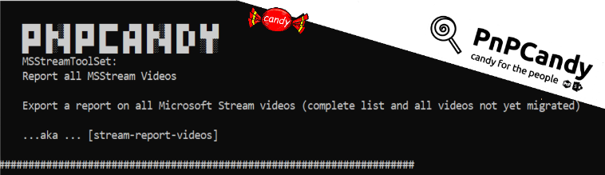

     
# Export a csv report on all Microsoft Stream videos



## Summary

Export a report on all Microsoft Stream (Classic) videos (build on SharePoint)
  
Microsoft Stream (Classic) will be retired soon , therefore we need to gather a list of all videos info for a mid-term migration   
This script allow us to export a list with all videos detailed in our tenant .


The script is a subset of the SPO PowerShell packages with content (PnPCandy) concept already been used across many projects.  


Excelsior, hum? :P  

# [PnP PowerShell](#tab/pnpps)

```powershell


[CmdletBinding()]
param (
    [Parameter(Mandatory = $False)]
    [string]$ExportPath = ".\"
)
begin {
    $ErrorActionPreference = "Stop"
    $source = @"
[DllImport("wininet.dll", SetLastError = true)]
public static extern bool InternetSetOption(IntPtr hInternet, int dwOption, IntPtr lpBuffer, int lpdwBufferLength);

[DllImport("wininet.dll", SetLastError = true)]
public static extern bool InternetGetCookieEx(string pchURL, string pchCookieName, System.Text.StringBuilder pchCookieData, ref uint pcchCookieData, int dwFlags, IntPtr lpReserved);
"@
## Clear WebBrowser cookies 
function Clear-WebBrowser {
        begin {
            $WebBrowser = Add-Type -memberDefinition $source -passthru -name WebBrowser -ErrorAction SilentlyContinue
            $INTERNET_OPTION_END_BROWSER_SESSION = 42
            $INTERNET_OPTION_SUPPRESS_BEHAVIOR = 81
            $INTERNET_COOKIE_HTTPONLY = 0x00002000
            $INTERNET_SUPPRESS_COOKIE_PERSIST = 3
        }
        Process {
            
            # Clear the cache
            [IntPtr] $pointer = [IntPtr]::Zero
            $session = [System.Runtime.InteropServices.Marshal]::SizeOf($INTERNET_OPTION_END_BROWSER_SESSION)
            $pointer = [System.Runtime.InteropServices.Marshal]::AllocCoTaskMem($session)
            [System.Runtime.InteropServices.Marshal]::WriteInt32($pointer, ([ref]$INTERNET_SUPPRESS_COOKIE_PERSIST).Value)
            $status = $WebBrowser::InternetSetOption([IntPtr]::Zero, $INTERNET_OPTION_SUPPRESS_BEHAVIOR, $pointer, $session)
            [System.Runtime.InteropServices.Marshal]::Release($pointer) | out-null
    
            # Clear the current session
            $status = $WebBrowser::InternetSetOption([IntPtr]::Zero, $INTERNET_OPTION_END_BROWSER_SESSION, [IntPtr]::Zero, 0)
        }
    }

    ## From built for MsStream authentication
    function Show-OAuthWindowStream {
        param (
            [string]$url,
            [string]$WindowTitle,
            ## Default value : resource for teams
            [string]$Resource,
            ## Default value : edirect for native teams app
            [string]$Auth_Redirect,
            [string]$ClientId,
            [string]$Tenant,
            [bool]$ForceMFA = $false
        )
        if ([String]::IsNullOrEmpty($Tenant)) {
            $Tenant = "common"
        }
        # Create the url
        $request_id = (New-Guid).ToString()
        
        if ($ForceMFA) {
            $url += "&amr_values=mfa"
        }
        
        Add-Type -AssemblyName System.Windows.Forms
        $form = New-Object -TypeName System.Windows.Forms.Form -Property @{Width = 600; Height = 800 }
        $form.Text = $WindowTitle

        $script:web = New-Object -TypeName System.Windows.Forms.WebBrowser -Property @{Width = 580; Height = 780; Url = ($URL -f ($Scope -join "%20")) }
        $web.ScriptErrorsSuppressed = $True
        $form.Controls.Add($web)
        $featured = {
            $head = $web.Document.GetElementsByTagName("head")[0];
            $scriptEl = $web.Document.CreateElement("script");
            $element = $scriptEl.DomElement;
            ## Capture MsStream tenant info and tokens! :P
            $element.text = "
          
            function CaptureToken() { 
                var tenantInfo = new Object();
                tenantInfo.AccessToken =''
                if (sessionInfo != undefined) {
                    tenantInfo = new Object();
                    token=sessionInfo.AccessToken;
                    tenantInfo.AccessToken = sessionInfo.AccessToken;
                    tenantInfo.TenantId = sessionInfo.UserClaim.TenantId;
                    tenantInfo.ApiGatewayUri  =sessionInfo.ApiGatewayUri;
                    tenantInfo.ApiGatewayVersion=sessionInfo.ApiGatewayVersion;
                    return (JSON.stringify(tenantInfo));
                  }
                return (JSON.stringify(tenantInfo));
            }
            ";
            $head.AppendChild($scriptEl);
            $tenantInfoString = $web.Document.InvokeScript("CaptureToken");
          
            $tenantInfo = ConvertFrom-Json $tenantInfoString
            if ($tenantInfo.AccessToken.length -ne 0 ) {
                $script:tenantInfo = $tenantInfo;
                $url = "https://login.windows.net/common/oauth2/logout"
                $form.Controls[0].Url = $url
                $form.Controls[0].Dispose()
                $form.Close()
                $form.Dispose()
                Clear-WebBrowser 
            }

        }
        $web.add_Navigated($featured)
        $form.Add_Shown( { $form.Activate() })
        $form.ShowDialog() | Out-Null
      
    }
    #Logging function
    function Write-Log($msg) {
        $message = "$($env:MainFunctionName)$($env:FunctionName) $msg"
        $message = $message.Trim()
        Write-Host $message
    }
    
    #Export Reports to a csv filename
    function Export-ReportAssets([psCustomObject]$assets, [string] $label, [string]$fileName,[bool] $showLastMessage) {
        if ($null -ne $assets) {
            Write-Log " Exporting [$($assets.Length)] $label(s) ..."
            $ExportPath = Resolve-Path $ExportPath
            $assets |  Export-Csv -Path "$ExportPath\$fileName.csv" -Force -NoTypeInformation
            if ($showLastMessage -eq $true)
            {
                Write-Log  " All info exported at [$ExportPath] "
            }
        }
        else {
            Write-Log " No $label(s) were found"
        }
      
    }
    #Camel Case Props Names to ease up report reading
    function Set-AttributesCammelCase([psCustomObject]$allItems, [string]$prefix) {
        #CammelCase all Properties
        $items = @();
        $allItems | ForEach-Object {
            $t = $_
            $newObj = [PSCustomObject]::new()
            if ($null -ne $t) {
                $t | Get-Member -MemberType Properties | ForEach-Object {
               
                    $obj = $_
                    if ($obj.Name -eq "posterImage")
                    {
                        $A=""
                    }
                    $name = ($_.Name.substring(0, 1).toupper() + $_.Name.substring(1, $_.Name.length - 1))
                    if ($_.Definition -match "Object") {
                        $n = $_.Name
                        $element = @(($t."$name")) 

                        $a = $t.$name
                        $name = ($n.substring(0, 1).toupper() + $n.substring(1, $n.length - 1))
                        $atts = Set-AttributesCammelCase -allItems $element -prefix $name
                        
                        if ($null -ne $atts) {
                            # $newObj = [PSCustomObject]::new()
                            if ($atts.Count -gt 1) {
                                $ct = 0
                                $atts |  ForEach-Object {
                                    $item = $_
                                    
                                    $item | Get-Member -MemberType Properties | ForEach-Object {
                                        $prop = $_
                                       
                                       
                                            $nname = $prop.Name
                                        
                                       
                                        $nvalue = $item."$nname"
                                        $newObj | Add-Member -Name  ("$ct$nname") -MemberType NoteProperty -Value  $nvalue
                                    }
                                    $ct++
                                }
                            }
                            else {
                                $atts | Get-Member -MemberType Properties | ForEach-Object {
                                    $prop = $_
                                    if ($prefix.Length -gt 0) {
                                        $pp= $prop.Name
                                        $nname = "$prefix.$pp" 
                                        $nvalue = $atts."$pp"
                                        }
                                    else{
                                        $nname = $prop.Name
                                        $nvalue = $atts."$nname"
                                    }
                                    $newObj | Add-Member -Name  $nname -MemberType NoteProperty -Value  $nvalue
                                }
                            }
                        }
                    }
               
                    else {
                        $newName = "$name"
                        if ($prefix.Length -gt 0) {
                            $newName = "$prefix.$name"
                        }
                        $newValue = $t."$name"
                        $newObj | Add-Member -Name $newName  -MemberType NoteProperty -Value  $newValue
                    }
                
               
                }
                $items += $newObj
            }
            
        }
        $items
    }
    #Fetch requested assets with paging (msstream only allows 100 items per page )
    function Get-RequestedAssets([PSCustomObject]$token, [string]$url, [int]$startIndex, [string]$label) {
        Write-Log " Fetching [$label] Assets Start"
        $index = $startIndex
        $mainUrl = $url
        $allItems = @()
        do {
            $restUrl = $mainUrl.Replace("`$skip=0", "`$skip=$index") 
            
            $items = @((Invoke-RestMethod -Uri $restUrl -Headers $token.headers -Method Get).value)
            if ($items.Count -ne 0) {
                $id = "[{0}]" -f $items[0].id
                $name = "[{0}]" -f $items[0].Name
                $txtIndex = ("[FirstElementOnTheBatch][{0}]" -f $index) + $id + $name
                Write-Log "  Fetching ... [Paging $txtIndex]"

                $items | Add-Member  -Name "Type" -MemberType NoteProperty -Value  $Label
                $items | Add-Member  -Name "ViewVideoUrl" -MemberType NoteProperty -Value  ("https://web.microsoftstream.com/video/" + $items.Id)
              
                $items = Set-AttributesCammelCase -allItems  $items
            }
            $allItems += $items
            $index += 100
            
        } until ($items.Count -eq 0)
        Write-Log ("  Found [" + $allItems.Count + "] items!")
        $assets = $allItems | SeLect-Object `
                                Type,Id, Name,@{Name='Size(MB)';Expression={$_.AssetSize/1MB}}, `
                                PrivacyMode, State,VideoMigrationStatus, Published,PublishedDate, 	
                            	ContentType,Created,Modified, `
                                Media.Duration,	Media.Height,Media.Width,`
                                Metrics.Comments,Metrics.Likes,Metrics.Views, `
                                ViewVideoUrl
        Write-Log " Fetching [$label] Assets End"
        
        $assets
    }
    #Main function to collect token and tenant configuration  
    function Get-StreamToken() {
       
        Show-OAuthWindowStream -url "https://web.microsoftstream.com/?noSignUpCheck=1" -WindowTitle  "Please login to Microsoft Stream ..."
        $token = $script:tenantInfo.AccessToken
        $headers = @{
            "Authorization"   = ("Bearer " + $token)
            "accept-encoding" = "gzip, deflate, br"
        }
        $urlTenant = $script:tenantInfo.ApiGatewayUri
        $apiVersion = $script:tenantInfo.ApiGatewayVersion
        
        $urlBase = "$urlTenant{0}?`$skip=0&`$top=100&adminmode=true&api-version=$apiVersion" 
        
        $requestToken = [PSCustomObject]::new()
        $requestToken | Add-Member  -Name "token" -MemberType NoteProperty -Value  $token
        $requestToken | Add-Member  -Name "headers" -MemberType NoteProperty -Value  $headers
        $requestToken | Add-Member  -Name "tenantInfo" -MemberType NoteProperty -Value $script:tenantInfo
        
        $urls = [PSCustomObject]::new()
        $requestToken | Add-Member  -Name "urls" -MemberType NoteProperty -Value  $urls

        $requestToken.urls | Add-Member  -Name "Videos" -MemberType NoteProperty -Value  ($urlBase -f "videos")
        $requestToken.urls | Add-Member  -Name "Channels" -MemberType NoteProperty -Value   ($urlBase -f "channels")
        $requestToken.urls | Add-Member  -Name "Groups" -MemberType NoteProperty -Value  ($urlBase -f "groups")
        
        $urlBase = $urlBase.replace("`$skip=0&", "")
        $requestToken.urls | Add-Member  -Name "Principals" -MemberType NoteProperty -Value   ($urlBase -f "principals")

        $requestToken
    }
  
    $env:functionName = ""
    $env:MainFunctionName = ""


    $msg = "`n`r`n`r

    █▀█ █▄░█ █▀█ █▀▀ ▄▀█ █▄░█ █▀▄ █▄█
    █▀▀ █░▀█ █▀▀ █▄▄ █▀█ █░▀█ █▄▀ ░█░  `n    MSStreamToolSet: `n`r    Report all MSStream Videos    `n`n    Export a report on all Microsoft Stream videos (complete list and all videos not yet migrated) `n`n    ...aka ... [stream-report-videos]
    `n"
    $msg += ('#' * 70) + "`n"
    Write-Output  $msg
    $env:functionName = "[Report-Stream-Videos]"

}
process {
   
    $streamTokenConfiguration = Get-StreamToken -Tenant $Tenant -Credentials $creds
    $allVideos = Get-RequestedAssets -token $streamTokenConfiguration -url $streamTokenConfiguration.urls.Videos -startIndex 0 -label "Videos"
    Export-ReportAssets -assets $allVideos -label "Videos"-fileName "StreamVideosAll" 
    $videosNotMigrated = $allVideos | Where-Object {$_.VideoMigrationStatus -eq "NotStarted"}
    Export-ReportAssets -assets $videosNotMigrated -label "VideosNotMigrated"-fileName "StreamVideosNotMigrated" -showLastMessage $true
    
}
end {
    Write-Log "All done"
}


```
[!INCLUDE [More about PnP PowerShell](../../docfx/includes/MORE-PNPPS.md)]


# [PnP PowerShell Alternative](#tab/pnpps2)

```powershell

[CmdletBinding()]
param (
    [parameter(Position=0,Mandatory=$False)] 
    [string]$OutputCsvFileName,

    [parameter(Position=1,Mandatory=$False)] 
    [switch]$OpenFileWhenComplete = $False
)


# ----------------------------------------------------------------------------------------------
function Show-OAuthWindowStream {
    param (
        [string]$Url,
        [string]$WindowTitle
    )
       
    $Source = `
@"
    [DllImport("wininet.dll", SetLastError = true)]
    public static extern bool InternetSetOption(IntPtr hInternet, int dwOption, IntPtr lpBuffer, int lpdwBufferLength);
"@

    $WebBrowser = Add-Type -memberDefinition $Source -passthru -name $('WebBrowser'+[guid]::newGuid().ToString('n'))
    $INTERNET_OPTION_END_BROWSER_SESSION = 42
    # Clear the current session
    $WebBrowser::InternetSetOption([IntPtr]::Zero, $INTERNET_OPTION_END_BROWSER_SESSION, [IntPtr]::Zero, 0) | out-null

    Add-Type -AssemblyName System.Windows.Forms
    $Form = New-Object -TypeName System.Windows.Forms.Form -Property @{Width = 600; Height = 800 }

    $Script:web = New-Object -TypeName System.Windows.Forms.WebBrowser -Property @{Width = 580; Height = 780; Url = ($URL -f ($Scope -join "%20")) }
    $Web.ScriptErrorsSuppressed = $True
    $Form.Controls.Add($Web)
    $Featured = {
        $Head = $Web.Document.GetElementsByTagName("head")[0];
        $ScriptEl = $Web.Document.CreateElement("script");
        $Element = $ScriptEl.DomElement;

        # Javascript function to get the sessionInfo including the Token
        $Element.text = `
@'
        function CaptureToken() { 
            if( typeof sessionInfo === undefined ) {
                return '';
            } else {
                outputString = '{';
                outputString += '"AccessToken":"' + sessionInfo.AccessToken + '",';
                outputString += '"TenantId":"' + sessionInfo.UserClaim.TenantId + '",';
                outputString += '"ApiGatewayUri":"' + sessionInfo.ApiGatewayUri + '",';
                outputString += '"ApiGatewayVersion":"' + sessionInfo.ApiGatewayVersion + '"';
                outputString += '}';

                return outputString;
            }
        }
'@;

        $Head.AppendChild($ScriptEl);
        $TenantInfoString = $Web.Document.InvokeScript("CaptureToken");
            
        if( [string]::IsNullOrEmpty( $TenantInfoString ) -eq $False ) {
            $TenantInfo = ConvertFrom-Json $TenantInfoString
            if ($TenantInfo.AccessToken.length -ne 0 ) {
                $Script:tenantInfo = $TenantInfo;
                $Form.Controls[0].Dispose()
                $Form.Close()
                $Form.Dispose()
            }
        }

    }
    $Web.add_DocumentCompleted($Featured)
    $Form.AutoScaleMode = 'Dpi'
    $Form.ShowIcon = $False
    $Form.Text = $WindowTitle
    $Form.AutoSizeMode = 'GrowAndShrink'
    $Form.StartPosition = 'CenterScreen'
    $Form.Add_Shown( { $Form.Activate() })
    $Form.ShowDialog() | Out-Null

    write-output $Script:tenantInfo
}

# ----------------------------------------------------------------------------------------------
function Get-RequestedAssets([PSCustomObject]$Token, [string]$Url, [string]$Label) {
    $Index = 0
    $MainUrl = $Url
    $AllItems = @()
    do {
        $RestUrl = $MainUrl.Replace("`$skip=0", "`$skip=$Index") 
            
        Write-Host "  Fetching ... $($Index) to $($Index+100)"
        $Items = @((Invoke-RestMethod -Uri $RestUrl -Headers $Token.headers -Method Get).value)

        $AllItems += $Items
        $Index += 100
            
    } until ($Items.Count -lt 100)

    Write-Host "  Fetched $($AllItems.count) items"

    $Assets = $AllItems | Select-Object `
                            @{Name='Type';Expression={$Label}},`
                            Id, Name,`
                            @{Name='Size(MB)';Expression={$_.AssetSize/1MB}}, `
                            PrivacyMode, State, VideoMigrationStatus, Published, PublishedDate, ContentType, Created, Modified, `
                            @{name='Media.Duration';Expression={$_.Media.Duration}},`
                            @{name='Media.Height';Expression={$_.Media.Height}},`
                            @{name='Media.Width';Expression={$_.Media.Width}},`
                            @{name='Metrics.Comments';Expression={$_.Metrics.Comments}},`
                            @{name='Metrics.Likes';Expression={$_.Metrics.Likes}},`
                            @{name='Metrics.Views';Expression={$_.Metrics.Views}}, `
                            @{name='ViewVideoUrl';Expression={("https://web.microsoftstream.com/video/" + $_.Id)}}
        
    write-output $Assets
}

# ----------------------------------------------------------------------------------------------
function Get-StreamToken() {
        
    $TenantInfo = Show-OAuthWindowStream -url "https://web.microsoftstream.com/?noSignUpCheck=1" -WindowTitle  "Please login to Microsoft Stream ..."
    $Token = $TenantInfo.AccessToken
    $Headers = @{
        "Authorization"   = ("Bearer " + $Token)
        "accept-encoding" = "gzip, deflate, br"
    }
    $UrlTenant = $TenantInfo.ApiGatewayUri
    $ApiVersion = $TenantInfo.ApiGatewayVersion
        
    $UrlBase = "$UrlTenant{0}?`$skip=0&`$top=100&adminmode=true&api-version=$ApiVersion" 
        
    $RequestToken = [PSCustomObject]::new()
    $RequestToken | Add-Member  -Name "token" -MemberType NoteProperty -Value  $Token
    $RequestToken | Add-Member  -Name "headers" -MemberType NoteProperty -Value  $Headers
    $RequestToken | Add-Member  -Name "tenantInfo" -MemberType NoteProperty -Value $TenantInfo
        
    $Urls = [PSCustomObject]::new()
    $RequestToken | Add-Member  -Name "urls" -MemberType NoteProperty -Value  $Urls

    $RequestToken.urls | Add-Member  -Name "Videos" -MemberType NoteProperty -Value  ($UrlBase -f "videos")
    $RequestToken.urls | Add-Member  -Name "Channels" -MemberType NoteProperty -Value   ($UrlBase -f "channels")
    $RequestToken.urls | Add-Member  -Name "Groups" -MemberType NoteProperty -Value  ($UrlBase -f "groups")
        
    $UrlBase = $UrlBase.replace("`$skip=0&", "")
    $RequestToken.urls | Add-Member  -Name "Principals" -MemberType NoteProperty -Value   ($UrlBase -f "principals")

    write-output $RequestToken
}

$StreamToken = Get-StreamToken
$ExtractData = Get-RequestedAssets -token $StreamToken -Url $StreamToken.Urls.Videos -Label "Videos"

if( $OutputCsvFileName ) {
    $ExtractData | Export-CSV $OutputCsvFileName -NoTypeInformation -Encoding UTF8
    if( $OpenFileWhenComplete ) {
        Invoke-Item $OutputCsvFileName
    }
} else {
    write-output $ExtractData
}

```
[!INCLUDE [More about PnP PowerShell](../../docfx/includes/MORE-PNPPS.md)]
***

## Contributors

| Author(s) |
|-----------|
| Rodrigo Pinto |
| Twan van Beers |

[!INCLUDE [DISCLAIMER](../../docfx/includes/DISCLAIMER.md)]


