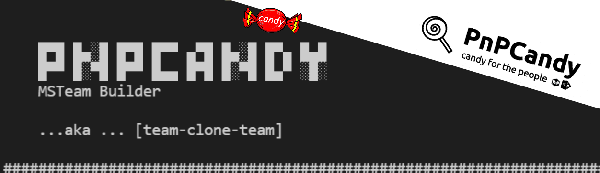

      
# Clone a Microsoft Team



## Summary

This script allow us to clone an existing team into a new one with changed properties.  

On the new to be "cloned" team we can define name, description, visibility and "parts to clone" ("Apps","Tabs","Settings","Channels",  "Members") 

Latest update, added the -IncludeContent  switch ... allowing to actual clone structure and content !!


The script is a subset of the SPO powershell packages with content (PnPCandy) concept already been used across many projects.  
  
Excelsior, hum? :P  

# [PnP PowerShell](#tab/pnpps)

```powershell


# 2021-11-02 Added better logging Teams and  provision validation
# 2021-11-02 Added IncludeContent switch
# 2021-12-29 Improved reporting\performance on clone team operation.
[CmdletBinding()]
param (
    [Parameter(Mandatory = $true)]
    [string]$Tenant ,
    [Parameter(Mandatory = $true)]
    [string]$Team ,
    [Parameter(Mandatory = $true)]
    [string]$NewTeamName,
    [Parameter(Mandatory = $true)]
    [string]$NewTeamDescription ,
    [Parameter(Mandatory = $true)]
    [string]$NewMailNickname,
    [Parameter(Mandatory = $true)]
    [ValidateSet("Private", "Public")]
    [string]$NewTeamVisibility,
    [Parameter(Mandatory = $false)]
    [ValidateSet("Apps", "Tabs", "Settings", "Channels", "Members")]
    [string[]]$PartsToClone = ("Apps", "Tabs", "Settings", "Channels", "Members"),
    [Parameter(Mandatory = $false)]
    [switch]$IncludeContent 

)
begin {
    $ErrorActionPreference = "Stop"
    Import-Module PnP.PowerShell
    # Write message to string or log file if its defined
    function Write-Log($msg) {
        
        $message = "$($env:MainFunctionName)$($env:FunctionName) $msg"
        $message = $message.Trim()
        Write-Host ($message)
        if ($Logfile.Length -gt 0) {
            Add-Content -Path $Logfile -Value $message -Force
        }
    }
    
    Function Get-FoldersFiles($folderUrl, [ref] $outAssets) {
        $items = Get-PnPFolderItem -FolderSiteRelativeUrl $folderUrl -ItemType All    
        # Loop through the folders  
        foreach ($asset in $items) { 
            # dont collect forms document library   
            if ($asset.Name -ne "Forms") {               
                $newItemURL = $folderUrl + "/" + $asset.Name   
                $item = New-Object PSObject
                $item | Add-Member -MemberType NoteProperty -Name 'ServerRelativeUrl' -Value $asset.ServerRelativeUrl
                $item | Add-Member -MemberType NoteProperty -Name 'LocalPath' -Value ($newItemURL -replace "/", "\")
               
                $item | Add-Member -MemberType NoteProperty -Name 'IsFolder' -Value  ($null -ne $asset.ItemCount)
                $item | Add-Member -MemberType NoteProperty -Name 'Leaf' -Value  ($newItemURL | Split-Path -Leaf  )
                
                $item | Add-Member -MemberType NoteProperty -Name 'RemotePath' -Value ($newItemURL | Split-Path) #(($newItemURL | Split-Path) -replace "\\", "/")
                [Hashtable] $t = $outAssets.Value
                $t.Add($asset.ServerRelativeUrl, $item)
                if ($null -ne $asset.ItemCount) {
                    Write-Log  "   Collecting  $newItemURL"
                    Get-FoldersFiles -folderUrl $newItemURL -outAssets ([ref]$t)
                }  
            }
        }
    } 
    Function Add-Content([string] $source , [string] $destination) {

        Write-Log "    Start"
        Write-Log "    Content from $source will be cloned to $destination"
        ## Get all document libraries
        Connect-PnPOnline -Url $source -Interactive
        $doclib = Get-PnPList -Includes RootFolder | where-object { $_.BaseTemplate -eq 101 -and $_.Title -eq "Documents" }
        $folderDest = ($destination + "/" + (Get-PnPProperty -ClientObject $doclib.RootFolder -Property Name))
        $subfolders = Get-PnPFolder -List $doclib 
        $subfolders.foreach({
                Write-Log ("     $($_.ServerRelativeUrl) cloned to $folderDest")  
                Copy-PnPFile -SourceUrl $_.ServerRelativeUrl -TargetUrl $folderDest -OverwriteIfAlreadyExists -Force   
            })
        Write-Log "    All content was cloned ! "
        Write-Log "    End"
    } 
 
    $env:functionName = ""
    $env:MainFunctionName = ""
    $msg = "`n`r`n`r

    █▀█ █▄░█ █▀█ █▀▀ ▄▀█ █▄░█ █▀▄ █▄█
    █▀▀ █░▀█ █▀▀ █▄▄ █▀█ █░▀█ █▄▀ ░█░  `n    MSTeam Builder: `n`r   ...aka ... [team-clone-team]
    `n"
    $msg += ('#' * 70) + "`n"
    Write-Output  $msg
    
    $env:functionName = "[Clone-Team]"
    #Validate if PartsToClone has duplicate values 
    $tmp = $PartsToClone | Group-Object | Where-Object -Property Count -gt 1
    if ($null -ne $tmp) {
        throw "PartsToClone : The following values are duplicated: $($tmp.Name -join ', ')"
    }
    $Url= "https://" + $tenant.ToLower().Replace(".onmicrosoft.com",".sharepoint.com")
    Write-Log "Start"
    Write-Log " Connecting to $Url"
    Connect-PnPOnline -Url $Url -Interactive -Tenant $Tenant
    $accesstoken = Get-PnPAccessToken
    
}
process {

    Write-Log "   Get Team by name or Id [$team]"
    $existingTeam = Get-PnPMicrosoft365Group  -IncludeSiteUrl | Where-object { $_.HasTeam -and (($_.id -eq $Team) -or ($_.Displayname -eq $Team)) } | Select-Object Id, DisplayName, SiteUrl
    if ($existingTeam.Length -gt 1)
    {
        Write-Log ("    Hum... It seems you have [" + $existingTeam.Length + "] named [$Team]. Freaky!!!")
        $selectedTeam = $existingTeam[0]
        Write-Log ("    Selecting the first on the list ... id[{0}],name[{1}],url[{2}]" -f $selectedTeam.id,$selectedTeam.DisplayName,$selectedTeam.SiteUrl )
        $existingTeam = $selectedTeam
    }
    $cloneUrl = "https://graph.microsoft.com/beta/teams/$($existingTeam.Id)/clone"  
   
    $NewTeamDescription = $NewTeamDescription.Trim()
    if ($NewTeamDescription.Trim().Length -eq 0) { 
        Write-Log ("   Fill in description if empty")
        $NewTeamDescription = $NewTeamName
    }
    Write-Log ("   Cleanup MailNickname (remove spaces)")
    $NewMailNickname = $NewMailNickname.Trim().Replace(" ", "")
    if ($NewMailNickname.Trim().Length -eq 0) {
        $NewMailNickname = $NewTeamName.ToLower()
    }
    $tmp = ($PartsToClone -join ",").ToLower()
    if ($tmp.Trim().Length -eq 0) {
        Write-Log ("   Parts To Clone if empty")
        $PartsToClone = ("Apps", "Tabs", "Settings", "Channels", "Members")
        $PartsToClone = ($PartsToClone -join ",").ToLower()
    }
  
    $newTeam = '{ 
        "displayName": "'+ $NewTeamName + '",
        "description": "'+ $NewTeamDescription + '",
        "mailNickname": "'+ $NewMailNickname + '",
        "partsToClone": "apps,tabs,settings,channels,members",
        "visibility": "'+ $NewTeamVisibility + '"
        }'
    Write-Log ("   Clone new Team:$NewTeamName")

    ## Changed from Rest to WebRequest since Invoke-Rest doesn't return Headers
    $r = Invoke-WebRequest -Headers @{Authorization = "Bearer $accesstoken"; "Content-Type" = "application/json" } `
        -Uri $cloneUrl -Body $newTeam -Method POST 
    
    #Cloning is a long-running operation. After the POST clone returns, 
    #We need to GET the operation to see if it's 'running' or 'succeeded' or 'failed'. 
    #We should continue to GET until the status is not 'running'. 
    #The recommended delay between GETs is 5 seconds.   
    Start-Sleep 15
    $getUrl = "https://graph.microsoft.com/beta" + $r.Headers.Location   
    $result = Invoke-RestMethod -Headers @{Authorization = "Bearer $accesstoken"; "Content-Type" = "application/json" } `
        -Uri $getUrl  -Method Get 

    while( ($result.status -eq "inProgress")-or ($result.status -eq "Pending")) {
        Start-Sleep 6    
        $result = Invoke-RestMethod -Headers @{Authorization = "Bearer $accesstoken"; "Content-Type" = "application/json" } `
            -Uri $getUrl  -Method Get 
        Write-Log ("   Cloning team ..." + $result.status)
        Write-Log ("    Current Status")
        $objs = $result |select-object @{l="Operation";e={$_.operationType}},createdDateTime,lastActionDateTime,status,attemptsCount,error 
        $info= "   " + ($objs|out-string)
        Write-Log ("    `n`r $info `n`r`n`r")
        Write-Log ("   Cloning team ..." + $result.status)
    }  

    if ($IncludeContent) {
        Write-Log ("   IncludeContent switch was request")
        Write-Log ("   Copy Content from [$Team] to [$NewTeamName]")
        Write-Log ("   Disconnect and Reconnect in order to get latest created team")
        Connect-PnPOnline -Url $Url -Interactive -Tenant $Tenant
        $clonedTeam = Get-PnPMicrosoft365Group  -IncludeSiteUrl -Identity $result.targetResourceId  
        Connect-PnPOnline -Url $clonedTeam.SiteUrl -Interactive -Tenant $Tenant
        $destinationUrl = (Get-PnPWeb).ServerRelativeUrl
        Add-Content -source $existingTeam.SiteUrl -destination $destinationUrl
    }
    Write-Log ("  Team [$NewTeamName] was cloned from [$($existingTeam.DisplayName)]")
    Disconnect-PnPOnline
    Write-Log ("Disconnected")
}

```
[!INCLUDE [More about PnP PowerShell](../../docfx/includes/MORE-PNPPS.md)]
***

## Contributors

| Author(s) |
|-----------|
| Rodrigo Pinto |

[!INCLUDE [DISCLAIMER](../../docfx/includes/DISCLAIMER.md)]


