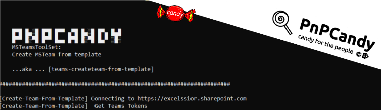

   
# Create Team from template



## Summary

Create Team from template

This script allow us to create a Teams based on a template.  

The script uses Teams Native API  and is a subset of the SPO powershell packages with content (PnPCandy) concept already been used across many projects.  


Excelsior, hum? :P  

# [PnP PowerShell](#tab/pnpps)

```powershell

[CmdletBinding()]
param (
    [Parameter(Mandatory = $True)]
    [string]$Tenant ,
    [Parameter(Mandatory = $False)]
    [string]$StoredCredentials,
    [Parameter(Mandatory = $True)]
    [string]$TeamTemplateNameOrId,
    [ValidateSet("ExportTemplate", "ApplyTemplate")]
    [Parameter(Mandatory = $False)]
    [string]$Option = "ExportTemplate",
    [Parameter(Mandatory = $False)]
    [string]$ExportPath = ".\",
    [Parameter(Mandatory = $False)]
    [string]$ExportedTemplateName = "newteam.json"
)
begin {
    $ErrorActionPreference = "Stop"
    $defaultResource = "https://api.spaces.skype.com"
    $defaultAuthRedirect = "https://login.microsoftonline.com/common/oauth2/nativeclient"
    ##Teams native app id
    $defaultClientId = "1fec8e78-bce4-4aaf-ab1b-5451cc387264"
    $ExportPath = Resolve-Path $ExportPath

    function ShowOAuthWindow {
        param (
            [string]$WindowTitle,
            ## Default value : resource for teams
            [string]$Resource = $defaultResource ,
            ## Default value : edirect for native teams app
            [string]$Auth_Redirect = $defaultAuthRedirect,
            [string]$ClientId = $defaultClientId,
            [string]$Tenant = $Tenant,
            [bool]$ForceMFA = $false
        )
        if ([String]::IsNullOrEmpty($Tenant)) {
            $Tenant = "common"
        }
        # Create the url
        $request_id = (New-Guid).ToString()
        $url = "https://login.microsoftonline.com/$Tenant/oauth2/authorize?resource=$Resource&client_id=$ClientId&response_type=code&haschrome=1&redirect_uri=$auth_redirect&client-request-id=$request_id&prompt=select_account&scope=openid profile"
        
        if ($ForceMFA) {
            $url += "&amr_values=mfa"
        }
        
        Add-Type -AssemblyName System.Windows.Forms
        $form = New-Object -TypeName System.Windows.Forms.Form -Property @{Width = 600; Height = 800 }
        $form.Text = $WindowTitle
        $web = New-Object -TypeName System.Windows.Forms.WebBrowser -Property @{Width = 580; Height = 780; Url = ($URL -f ($Scope -join "%20")) }
        $form.Controls.Add($web)

        $docComp = {
            $uri = $web.Url.AbsoluteUri
            if ($uri -match "error=[^&]*|access_token=[^&]*|id_token=[^&]*|code=[^&]*") { 
                $response = [Web.HttpUtility]::ParseQueryString($web.Url.Query)

                # Create a body for REST API request
                $body = @{
                    client_id    = $ClientId
                    grant_type   = "authorization_code"
                    code         = $response["code"]
                    redirect_uri = $Auth_Redirect
                }
                # Dispose the control
                $form.Controls[0].Dispose()
      
                # Set the content type and call the Microsoft Online authentication API
                $contentType = "application/x-www-form-urlencoded"
                $script:jsonResponse = Invoke-RestMethod -UseBasicParsing -Uri "https://login.microsoftonline.com/$Tenant/oauth2/token" -ContentType $contentType -Method POST -Body $body
                $form.Close() 
            }
        }
        $web.Add_DocumentCompleted($docComp)
        $form.Add_Shown( { $form.Activate() })
        $form.ShowDialog() | Out-Null
        #return tokens
        $script:jsonResponse
    }
    function Write-Log($msg) 
    {
        
        $message = "$($env:MainFunctionName)$($env:FunctionName) $msg"
        $message = $message.Trim()
        Write-Output $message
    }
    function Get-TenantId([string]$Tenant) {
        #Get TenantId !
        $obj = (Invoke-WebRequest https://login.windows.net/$Tenant/.well-known/openid-configuration | ConvertFrom-Json)
        $tenantId = $obj.token_endpoint.Split('/')[3]
        $tenantId
    }
    function Get-TeamsApiTokens([PSCredential] $Credentials, [string] $Tenant) {
        $tenantId = Get-TenantId -Tenant $Tenant
        if ($null -ne $Credentials) {
            #Access Token
            $p = [System.Runtime.InteropServices.Marshal]::PtrToStringAuto([System.Runtime.InteropServices.Marshal]::SecureStringToBSTR($Credentials.Password))
            #Get access token
            $body = @{
                "resource"   =  $defaultResource # resource
                "client_id"  = $defaultClientId # teams web app id
                "grant_type" = "password"
                "username"   = $Credentials.UserName #username
                "password"   = $p #clearpassword
                "scope"      = "user_impersonation" #scope
            }
            $url = "https://login.microsoftonline.com/%7B$tenantId%7D/oauth2/token"
            $regularTokens = Invoke-RestMethod -Uri $url -Body $body -Method Post 
        }
        else {
            $regularTokens = ShowOAuthWindow -WindowTitle "Connect to Teams"
        }
        # get Skype Token needed to access Teams Native API
        $regularHeadersAuth = @{
            "Authorization" = ("Bearer " + $regularTokens.access_token)
        }
        $url = "https://authsvc.teams.microsoft.com/v1.0/authz"
        $teamsTokens = Invoke-RestMethod -Uri $url -Headers $regularHeadersAuth  -Method Post 

        $skypeHeadersAuth = @{
            "Authorization" = ("Bearer " + $regularTokens.access_token)
            "x-skypetoken"  = $teamsTokens.tokens.skypeToken
        }

        $body = @{
            "grant_type"    = "refresh_token"
            "refresh_token" = $regularTokens.refresh_token
            "scope"         = "https://templates.teams.microsoft.com/.default"

        }
        $url = "https://login.microsoftonline.com/%7B$tenantId%7D/oauth2/v2.0/token"
        $templatesTokens = Invoke-RestMethod -Uri $url -Body $body -Headers $regularHeadersAuth  -Method Post 

        $templatesHeadersAuth = @{
            "Authorization" = ("Bearer " + $templatesTokens.access_token)
        }
        
        $mainTokens = [PSCustomObject]::new()
        $mainTokens | Add-Member -Name "requestTokens" -MemberType NoteProperty -Value $regularTokens
        $mainTokens | Add-Member -Name "teamsTokens" -MemberType NoteProperty -Value $teamsTokens
        $mainTokens | Add-Member -Name "templatesTokens" -MemberType NoteProperty -Value $templatesTokens
        $mainTokens.teamsTokens | Add-Member  -Name "headers" -MemberType NoteProperty -Value  $skypeHeadersAuth
        $mainTokens.templatesTokens | Add-Member  -Name "headers" -MemberType NoteProperty -Value  $templatesHeadersAuth
        $mainTokens.requestTokens | Add-Member  -Name "headers" -MemberType NoteProperty -Value  $regularHeadersAuth
        $mainTokens
    }

    function Get-TeamsTemplates() {
        Write-Log " Get all Templates Start"
        $url = "https://teams.microsoft.com/fabric/emea/templates/api/teamtemplates/v1.0/en-us"
        $allTemplates = @((Invoke-RestMethod -Uri $url  -Headers $headers  -Method Get).value) 
        #Build token Object
    
        $templatesDefinitions = @();
        $allTemplates | ForEach-Object {
            $t = $_
            $t | Add-Member -Name "TeamDefinition"  -MemberType NoteProperty -Value ""
            $serviceUrl = $tokens.teamsTokens.regionGtms.teamsAndChannelsProvisioningService.replace("/api", "")
            $url = $serviceUrl + $t."@odata.id"
            $definition = @((Invoke-RestMethod -Uri $url  -Headers $headers  -Method Get).value) 
            $t.teamDefinition = $definition[0].teamDefinition
            $templatesDefinitions += $definition[0].teamDefinition
        }
        #CammelCase all Properties
        $templates = @();
        $allTemplates | ForEach-Object {
            $t = $_
            $newObj = [PSCustomObject]::new()
            $t | Get-Member -MemberType Properties | ForEach-Object {
                $name = ($_.Name.substring(0, 1).toupper() + $_.Name.substring(1, $_.Name.length - 1))
                
                $newObj | Add-Member -Name $name  -MemberType NoteProperty -Value  $t."$name"
            }
            $templates += $newObj
        }
        $allTemplates = $templates
        if (($null -ne $TeamTemplateNameOrId) -and ($TeamTemplateNameOrId -ne "")) {
            Write-Log "  Get specific template [$TeamTemplateNameOrId]"  
            $allTemplates = $templates | Where-object { ($_.id -eq $TeamTemplateNameOrId) -or ($_.name -eq $TeamTemplateNameOrId) }
        }
        $allTemplates = @($allTemplates | Select-Object Id, Name, Description, ShortDescription, ChannelCount, AppCount, IconUri, Scope, TeamDefinition, "@odata.id", ModifiedBy, ModifiedOn)
    
        if ($allTemplates.Length -gt 0) {
            Write-Log "  [$($allTemplates.Length)] Template(s) found"
        }
        else {
            Write-Log "  No Template(s) found"
        }
        $script:selectedTemplate = $allTemplates
        Write-Log " Get all Templates End"
    }
   
    $env:functionName = ""
    $env:MainFunctionName = ""


    $msg = "`n`r`n`r

    █▀█ █▄░█ █▀█ █▀▀ ▄▀█ █▄░█ █▀▄ █▄█
    █▀▀ █░▀█ █▀▀ █▄▄ █▀█ █░▀█ █▄▀ ░█░  `n    MSTeamsToolSet: `n`r    Create MSTeam from template    `n`n    ...aka ... [teams-createteam-from-template]
    `n"
    $msg += ('#' * 70) + "`n"
    Write-Output  $msg
    $env:functionName = "[Create-Team-From-Template]"
    ## Validate if Tenant value is ok
    if ($Tenant -notmatch '.onmicrosoft.com') {
        $msg = "Provided Tenant is not valid. Please use the following format [Tenant].onmicrosoft.com. Example:pnpcady.onmicrosoft.com"
        throw $msg
    }
    
    ## Validate if StoredCredentials value is ok
    $creds = $null
    if (![String]::IsNullOrEmpty($StoredCredentials)) {
        $creds = Get-PnPStoredCredential -Name $StoredCredentials -ErrorAction SilentlyContinue
        if ($null -eq $creds) {
            $msg = "Provided credentials [$StoredCredentials] not found  `n`r"
            $msg += "You can use [Add-PnPStoredCredential] to adds a credential to the Windows Credential Manager `n`r"
            $msg += "Link [https://docs.microsoft.com/en-us/powershell/module/sharepoint-pnp/add-pnpstoredcredential?view=sharepoint-ps]`n`r"
            throw $msg
        }
    }
    $url = "https://" + $Tenant.ToLower().Replace(".onmicrosoft.com", ".sharepoint.com")

    Write-Log "Connecting to $Url"
}
process {
    Write-Log " Get Teams Tokens"
    $tokens = Get-TeamsApiTokens -Credentials $creds -Tenant $Tenant
    $headers = $tokens.templatesTokens.headers
    Write-log  " Option[$Option] selected"
    switch ($Option) {
        "ExportTemplate" { 
            
            Get-TeamsTemplates
            $template = $script:selectedTemplate
            if ($template.Length -gt 0) {
                $templateDef = $template[0].TeamDefinition
                $requestBodyTmp = $templateDef | ConvertTo-Json -Compress -Depth 10
                $requestBodyTmp |  Set-Content -Path "$ExportPath\$ExportedTemplateName" -Force 
                Write-log  " Template exported at [$ExportPath] "
                Write-log  " Modify content at will, after, use the ApplyTemplate option "
            }else {
                
            }
        }
        "ApplyTemplate" {
            if (-Not(Test-Path "$ExportPath\$ExportedTemplateName")) {
                Write-log  " Template[$ExportedTemplateName] not found at [$ExportPath] !"
                throw
            }
            else {
                Write-log  " Template[$ExportPath\$ExportedTemplateName] found."
                $requestBody = Get-Content -Path "$ExportPath\$ExportedTemplateName" -Raw
                $accessToken = $tokens.templatesTokens.access_token
                $headers = @{
                    "authorization"   = ("Bearer $accessToken")
                    "accept"          = "application/json"
                    "accept-encoding" = "gzip, deflate, br"
                } 
                Write-log  " Create team based in template[$ExportedTemplateName] found.`n`r Content: `n`r $requestBody  `n`r"
                $responseData = Invoke-RestMethod -UseBasicParsing   -Uri "https://teams.microsoft.com/fabric/emea/templates/api/team" -ContentType "application/json"  -Headers $headers -Method Post -Body  $requestBody 
                        
                #Team creation is a long-running operation. After the POST , 
                #ee need to GET the operation to see if it's 'running' or 'succeeded' or 'failed'. 
                #We should continue to GET until the status is not 'running'. 
                #The recommended delay between GETs is 5 seconds.   
                Start-Sleep 10
                
                $getUrl = "https://teams.microsoft.com/fabric/emea/templates/api/workflow/status/{0}/team" -f $responseData.workflowId 
                $result = Invoke-RestMethod -Headers @{Authorization = "Bearer $accesstoken"; "Content-Type" = "application/json" } `
                    -Uri $getUrl  -Method Get 
                
                while (($result.status -eq "inProgress") -or ($result.status -eq "Pending")) {
                    Start-Sleep 5    
                    $result = Invoke-RestMethod -Headers @{Authorization = "Bearer $accesstoken"; "Content-Type" = "application/json" } `
                        -Uri $getUrl  -Method Get 
                    Write-Log ("   Provisioning team ..." + $result.status)
                    Write-Log ("    Current Status")
                    $objs = $result.apps |select-object @{l="Name";e={"Apps"}},index,status,updateTimestamp 
                    $objs += $result.channels |select-object  @{l="Name";e={"Channels"}},index,status,updateTimestamp
                    $info= "   " + ($objs|out-string)
                    Write-Log ("    `n`r $info `n`r`n`r")
                    Write-Log ("   Provisioning team ..." + $result.status)
                }  
                Write-Log ("   Team provisioned")
            }
        }
    }
 
 
    
}
end {
    Write-Log "All done"
}


```
[!INCLUDE [More about PnP PowerShell](../../docfx/includes/MORE-PNPPS.md)]
***

## Contributors

| Author(s) |
|-----------|
| Rodrigo Pinto |

[!INCLUDE [DISCLAIMER](../../docfx/includes/DISCLAIMER.md)]

