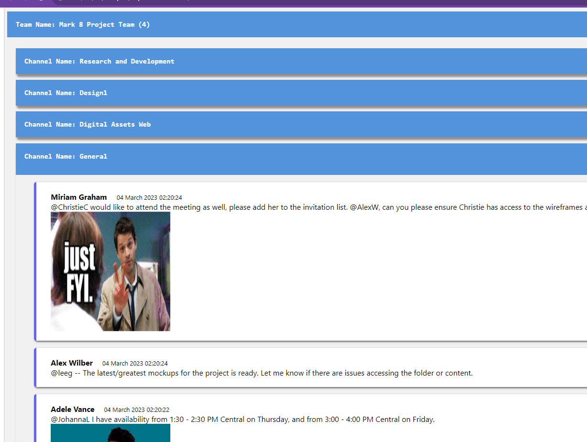

# Export Teams's Channel Conversation to html file

## Summary

This PowerShell script will export the teams channel conversations to an HTML file with expand collapse feature based on Teams and channel. The output file has inline html/css which makes it in readable format with propering indentation. Ideally the script can be used to export the conversation before archiving/deleting the channel but storing the conversation somewhere in SharePoint. We can set this up in Azure Runbook as part of our automation.

## Implementation
- Install the prerequisites from https://pnp.github.io/cli-microsoft365/user-guide/installing-cli/#
- Install latest version of powershell (minimum version required is 7.3)
- Create a folder "D:\PowerShell to export teams conversation\Export" 
- Run the script on PS Version 7 or above

Note - If you need to run this as admin - you can login to M365 CLI using your custom App Registration and provide application permission to connect after provide proper permission to read 

## Sample Output

[Sample output file](assets/20230913-174449.html)


 
# [PnP PowerShell](#tab/pnpps)
```powershell

  function Get-login {
  m365 login 
  # you can uncomment if you want to connect via Azure AD app registratoin
  #m365 login --appId 33234134c4-c234c4-4234bb-a25e-02342341a75 --tenant 5234b0-1234b-4234d-8d234b-6324ks329399
}

function  Get-Teams {
  #Get all teams 
  #$teams = m365 teams team list -o json | ConvertFrom-Json -AsHashtable

  #Get teams of current logged in user
  $teams = m365 teams team list --joined -o json | ConvertFrom-Json -AsHashtable
  return $teams
}
function  Get-Channels {
  param (
    [Parameter(Mandatory = $true)] [string] $teamId
  )
  $channels = m365 teams channel list --teamId $teamId -o json | ConvertFrom-Json -AsHashtable
  return $channels
}
function  Get-Messages {
  param (
    [Parameter(Mandatory = $true)] [string] $teamId,
    [Parameter(Mandatory = $true)] [string] $channelId
  )
  $messages = m365 teams message list --teamId $teamId --channelId $channelId -o json | ConvertFrom-Json -AsHashtable
  return $messages
}
function  Get-MessageReplies {
  param (
    [Parameter(Mandatory = $true)] [string] $teamId,
    [Parameter(Mandatory = $true)] [string] $channelId,
    [Parameter(Mandatory = $true)] [string] $messageId
  )

  $messageReplies = m365 teams message reply list --teamId $teamId --channelId $channelId --messageId $messageId -o json | ConvertFrom-Json -AsHashtable
  return $messageReplies
}

Try {
  $teamsCollection = [System.Collections.ArrayList]@()
  Get-login
  $teams = Get-Teams
  $progressCountTeam = 1;

  $filePath="D:\PowerShell to export teams conversation\Export"

  foreach ($team in $teams) {
    Write-Progress -Id 0 -Activity "Processing channels in Team : $($team.displayName)" -Status "Team $progressCountTeam of $($teams.length)" -PercentComplete (($progressCountTeam / $teams.length) * 100)
    $channelsCollection = [System.Collections.ArrayList]@()
    $channels = Get-Channels $team.id
    $progressCountChannel = 1;
    foreach ($channel in $channels) {
      Write-Progress -Id 1 -ParentId 0 -Activity "Processing messages in channel : $($channel.displayName)" -Status "Channel $progressCountChannel of $($channels.length)" -PercentComplete (($progressCountChannel / $channels.length) * 100)
      $messages = Get-Messages $team.id $channel.id
      $messagesCollection = [System.Collections.ArrayList]@()
      foreach ($message in $messages) {
        $messageReplies = Get-MessageReplies $team.id $channel.id $message.id
        $messageDetails = $message
        [void]$messageDetails.Add("replies", $messageReplies)
        [void]$messagesCollection.Add($messageDetails)
      }
      $channelDetails = $channel
      [void]$channelDetails.Add("messages", $messagesCollection)
      [void]$channelsCollection.Add($channelDetails)
      $progressCountChannel++
    }
    $teamDetails = $team
    [void]$teamDetails.Add("channels", $channelsCollection)
    [void]$teamsCollection.Add($teamDetails)
    $progressCountTeam++
  }
  Write-Progress -Id 0 -Activity " " -Status " " -Completed
  Write-Progress -Id 1 -Activity " " -Status " " -Completed
  $output = @{}
  [void]$output.Add("teams", $teamsCollection)
  $executionDir = $PSScriptRoot
  
  # ConvertTo-Json cuts off data when exporting to JSON if it nests too deep. The default value of Depth parameter is 2. Set your -Depth parameter whatever depth you need to preserve your data.
  $teamsExportRaw=$output | ConvertTo-Json -Depth 100 |ConvertFrom-Json
  $teamsJson= $teamsExportRaw.teams
$HtmlNew=''
for($a=0;$a -lt $teamsJson.length;$a++){
    
	$HtmlNew+='<div class="container" style=" border: 2px solid #dedede; background-color: #f1f1f1;border-radius: 5px;  padding: 5px;  margin: 1px 0;"><h1>Team Name: '+$teamsJson[$a].displayName+'</h1>';
    for($b=0;$b -lt $teamsJson[$a].channels.length;$b++){
           
    $HtmlNew+='<div style="background-color: #fff;box-shadow: 2px 6px 4px #615353a3;border-radius: 5px;"><h2 style="padding: 20px;background-color: #fff;">Channel Name: '+$teamsJson[$a].channels[$b].displayName+'</h2>';
           for($c=0;$c -lt $teamsJson[$a].channels[$b].messages.length;$c++){

			   if($teamsJson[$a].channels[$b].messages[$c].messageType -eq 'message'){                   
                    $HtmlNew+='<div style="font-family: Segoe UI,system-ui,Apple Color Emoji,Segoe UI Emoji,sans-serif;padding-left:40px;padding: 20px;border-left: 5px solid #0000ff9c;margin-left: 20px;background-color:#fff;box-shadow: 2px 2px 4px #000000a3; border-radius: 5px;"><div style="margin:0 10px"><b>'+$teamsJson[$a].channels[$b].messages[$c].from.user.displayName+'</b>'
				    $date=Get-Date $teamsJson[$a].channels[$b].messages[$c].createdDateTime -DisplayHint DateTime
				    $HtmlNew+='<span style="padding:0 20px;font-size: 13px;">'+ $date.DateTime +'</span></div>'
                    $msgContent=$teamsJson[$a].channels[$b].messages[$c].body.content
                    if ($msgContent -ne $null){
							if($msgContent.contains('<at')){
                                $msgContent=$msgContent -replace '<at .*?>','@' -replace '</at>',''
                            }
                            if($msgContent.contains('\')){
                              $msgContent=$msgContent.Replace("\","")
                             }	
                             if($msgContent.contains(' ')){
                              $msgContent=$msgContent.Replace(' ',"")
                             }	
                             if($msgContent.contains('<br>')){
                              $msgContent=$msgContent.Replace("<br>","")
                             }					
					 $HtmlNew+='<div style="margin:0 10px">'+$msgContent+'</div>'

                     if($teamsJson[$a].channels[$b].messages[$c].attachments.length -gt 0){
                        for($i=0;$i -lt $teamsJson[$a].channels[$b].messages[$c].attachments.length;$i++){
                        $HtmlNew+='<div style="margin:0 10px">View Attachment-<a href=" '+$teamsJson[$a].channels[$b].messages[$c].attachments[$i].contentUrl+'>"'+$teamsJson[$a].channels[$b].messages[$c].attachments[$i].name+'</a></div>'
                        }
                     }
						for($d=0;$d -lt $teamsJson[$a].channels[$b].messages[$c].replies.length;$d++){
							
                                $HtmlNew+='<div  style="padding-left: 20px;margin:10px 10px 0 10px"><b>'+$teamsJson[$a].channels[$b].messages[$c].replies[$d].from.user.displayName+'</b>'
                                $date=Get-Date $teamsJson[$a].channels[$b].messages[$c].replies[$d].createdDateTime -DisplayHint DateTime
                                $HtmlNew+='<span style="padding: 0 20px;margin:0 10px;font-size: 13px;">'+$date.DateTime +'</span></div>'
                                $msgContent=$teamsJson[$a].channels[$b].messages[$c].replies[$d].body.content

                                
                                  if($msgContent.contains('<at')){
                                    $msgContent=$msgContent -replace '<at .*?>','@' -replace '</at>',''
                                   }
                                   
                                   if($msgContent.contains('\')){
                                     $msgContent=$msgContent.Replace("\","")
                                    }
   
                                    if($msgContent.contains(' ')){
                                     $msgContent=$msgContent.Replace(' ',"")
                                    }	
                                    if($msgContent.contains('<br>')){
                                     $msgContent=$msgContent.Replace("<br>","")
                                    }
                                   $HtmlNew+='<div style="padding-left: 20px;margin:0 10px">'+$msgContent+'</div>'
                                   for($i=0;$i -lt $teamsJson[$a].channels[$b].messages[$c].replies[$d].attachments.length;$i++){
                                   $HtmlNew+='<div style="margin:0 30px">View Attachment-<a href="'+$teamsJson[$a].channels[$b].messages[$c].replies[$d].attachments[$i].contentUrl+'">'+$teamsJson[$a].channels[$b].messages[$c].replies[$d].attachments[$i].name+'</a></div>'
                               }

                          }
							    

						}
					$HtmlNew+='</div><br>';
				}
            
			}
$HtmlNew+='</div>';
	}
$HtmlNew+='</div>';
}

$outputFilePath = "$filePath/$(get-date -f yyyyMMdd-HHmmss).html"
$title = 'Teams Conversation'
$html = @"
<html>
<head><title>$title</title></head>
<body>
<pre>$HtmlNew</pre>
</body>
</html>
"@
$html | Out-File $outputFilePath

  Write-Host "Open $outputFilePath file to review your output" -F Green 
  m365 logout
}
Catch {
  $ErrorMessage = $_.Exception.Message
  Write-Error $ErrorMessage
  Continue
}
```
[!INCLUDE [More about Power Apps PowerShell](../../docfx/includes/MORE-POWERAPPS.md)]
***

## Contributors

| Author(s) |
|-----------|
| [Siddharth Vaghasia](https://github.com/siddharth-vaghasia) |

[!INCLUDE [DISCLAIMER](../../docfx/includes/DISCLAIMER.md)]


