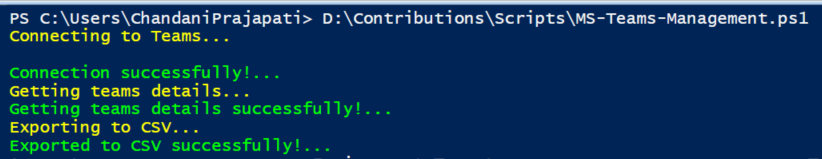

# Fetch Teams Information Using Teams PowerShell And Export To CSV

## Summary

This script showcases the use of Microsoft Teams PowerShell commands to retrieve team details, including ID, name, owner, members, channels, etc., and then exports the information to a CSV file.



## Implementation
 
Open Windows Powershell ISE
Create a new file and write a script
Install the Microsoft Teams module if it is not already installed using the `Install-Module MicrosoftTeams` command.
 
Now we will see all the steps which we required to achieve the solution:

1. Begin by establishing a connection to Microsoft Teams.
2. Retrieve the necessary details and store them in an array.
3. Export the collected data to a CSV file.

So at the end, our script will be like this,

# [MicrosoftTeams PowerShell](#tab/teamsps)

```powershell

$userName = "chandani@domain.onmicrosoft.com"
$password = "********"
$secureStringPwd = $password | ConvertTo-SecureString -AsPlainText -Force 
$creds = New-Object System.Management.Automation.PSCredential -ArgumentList $userName, $secureStringPwd
$dateTime = "_{0:MM_dd_yy}_{0:HH_mm_ss}" -f (Get-Date)
$basePath = "D:\Contributions\Scripts\Logs\"
$csvPath = $basePath + "\TeamsData" + $dateTime + ".csv"
$global:teamData = @()

Function Login() {    
    [cmdletbinding()]
    param([parameter(Mandatory = $true, ValueFromPipeline = $true)] $creds)
 
    #connect to teams    
    Write-Host "Connecting to Teams..." -f Yellow 
    Connect-MicrosoftTeams -Credential $creds
    Write-Host "Connection successfully!..." -f Green 
}

Function GetTeamsInformation {
    try {
        Write-Host "Getting teams details..." -ForegroundColor Yellow
        $allTeams = Get-Team
         
        Foreach ($team in $allTeams)
        {
            #Collect Team Data
            $teamGroupId = $team.GroupId.ToString()
            $teamChannels = Get-TeamChannel -GroupId $teamGroupId | Select-Object -Property DisplayName
            $teamChannelsName = $teamChannels | Foreach {"$($_.DisplayName)"}     
            $joinedTeamChannels = [String]::Join('; ',$teamChannelsName)  

            $global:teamData += [PSCustomObject] @{
                TeamName        = $team.DisplayName
                TeamID          = $teamGroupId
                MailAlias       = $team.MailNickName
                TeamType        = $team.Visibility
                TeamDescription = $team.Description
                TeamChannels    = $joinedTeamChannels
                TeamOwners      = (Get-TeamUser -GroupId $teamGroupId | Where {$_.Role -eq 'Owner'}).Name -join '; '
                TeamMembers     = (Get-TeamUser -GroupId $teamGroupId | Where {$_.Role -eq 'Member'}).Name -join '; '
            }
        }    
        Write-Host "Getting teams details successfully!..." -ForegroundColor Green    
     }	 
     catch {
        Write-Host "Error in getting teams information:" $_.Exception.Message -ForegroundColor Red                 
     } 

    Write-Host "Exporting to CSV..."  -ForegroundColor Yellow 
    $global:teamData | Export-Csv $csvPath -NoTypeInformation -Append
    Write-Host "Exported to CSV successfully!..."  -ForegroundColor Gree
}

Function StartProcessing {
    Login($creds); 
    GetTeamsInformation         
}

StartProcessing

```

[!INCLUDE [More about Microsoft Teams PowerShell](../../docfx/includes/MORE-TEAMSPS.md)]

***

## Contributors

| Author(s) |
|-----------|
| Chandani Prajapati (https://github.com/chandaniprajapati) |

[!INCLUDE [DISCLAIMER](../../docfx/includes/DISCLAIMER.md)]

