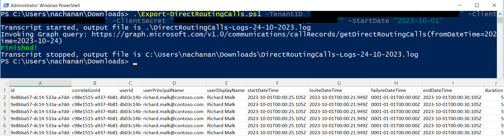

# Export Microsoft Teams Direct Routing Calls

## Summary

This script exports the log of direct routing calls for a given duration.



## Permissions

The PowerShell version of the script requires Microsoft Entra ID App Registration with the Application Permission as follows:
1. CallRecord-PstnCalls.Read.All
2. CallRecords.Read.All


> Note: You can skip this step, if you are planning to use CLI for Microsoft 365.

## Implementation

- Open Windows PowerShell ISE
- Create a new file
- Copy the code below
- Save the file and run it

# [PowerShell](#tab/ps)

```powershell
[CmdletBinding()]
param (
    [parameter(Mandatory)][string] $TenantID,
    [parameter(Mandatory)][string] $ClientID,
    [parameter(Mandatory)][string] $ClientSecret,
    [parameter(Mandatory)][DateTime] $StartDate,
    [parameter(Mandatory = $false)][DateTime] $EndDate = (Get-Date)
)

function Get-AccessToken {
    # Construct URI
    $uri = "https://login.microsoftonline.com/$TenantID/oauth2/v2.0/token"
	
    # Construct Body
    $body = @{
        client_id     = $ClientID
        client_secret = $ClientSecret
        scope         = 'https://graph.microsoft.com/.default'
        grant_type    = 'client_credentials'
    }
	
    # Fix for issue: The underlying connection was closed
    [Net.ServicePointManager]::SecurityProtocol = [Net.SecurityProtocolType]::Tls12

    # Get OAuth 2.0 Token
    $tokenRequest = Invoke-WebRequest -Method Post -Uri $uri -ContentType 'application/x-www-form-urlencoded' -Body $body -UseBasicParsing
	
    # Access Token
    return ($tokenRequest.Content | ConvertFrom-Json).access_token
}
  
function Get-GraphQueryOutput {
    param(
        [parameter(Mandatory = $true)][String] $Uri
    )

    $retryCount = 0
    $maxRetries = 3
    $pauseDuration = 2
    
    $token = Get-AccessToken
  
    $allRecords = @()
    while ($Uri) {
        try {
            Write-Host "Invoking Graph query: $($Uri)"
            $query = Invoke-RestMethod -Method Get -Uri $Uri -ContentType 'application/json;odata.metadata=none' -Headers @{Authorization = "Bearer $token" }
            $recordToAdd = ($query | Select-Object Value).Value
			
            if (-not $recordToAdd) {
                $recordToAdd = $query
            }

            $allRecords += $recordToAdd

            if ($query.'@odata.nextLink') {
                # set the url to get the next page of records
                $Uri = $query.'@odata.nextLink'
            } 
            else {
                $Uri = $null
            }  
        } 
        catch {
            Write-Host "StatusCode: " $_.Exception.Response.StatusCode.value__
            Write-Host "StatusDescription:" $_.Exception.Response.StatusDescription

            if ($_.Exception.Response.StatusCode.value__ -eq 401) {
                $token = Get-AccessToken
            }
  
            if ($_.ErrorDetails.Message) {
                Write-Host "Inner Error: $_.ErrorDetails.Message" -ForegroundColor Red
            }

            if ($_.Exception.Response.StatusCode.value__ -eq 404) {
                # If the error is "Not Found", let us not retry
                $retryCount = $maxRetries + 1
            }
            
            if ($retryCount -ge $maxRetries) {
                # Not going to retry again
                $Uri = $null
                Write-Host "Not going to retry..." -ForegroundColor Red
            } 
            else {
                $retryCount += 1
                $pauseDuration = $pauseDuration * 5
                Write-Host "Retry attempt $retryCount after a $pauseDuration second pause..." -ForegroundColor Yellow
                Start-Sleep -Seconds $pauseDuration
            }
        }
    }

    return $allRecords
}

Start-Transcript -Path ".\DirectRoutingCalls-Logs-$((Get-Date).toString("dd-MM-yyyy")).log"

$timeSpan = New-TimeSpan -Start (Get-Date -Date $StartDate) -End (Get-Date -Date $EndDate)
if ($timeSpan.Days -gt 90) {
    Write-Host "The maximum number of days between StartDate and EndDate cannot exceed 90" -ForegroundColor Red
    Write-Host "Please try again with a smaller time span." -ForegroundColor Red
    Exit
}

$fromDateTime = Get-Date -Date $StartDate -Format "yyyy-MM-dd"
$toDateTime = Get-Date -Date $EndDate -Format "yyyy-MM-dd"
$callRecords = Get-GraphQueryOutput -Uri "https://graph.microsoft.com/v1.0/communications/callRecords/getDirectRoutingCalls(fromDateTime=$fromDateTime,toDateTime=$toDateTime)"

ForEach ($record in $callRecords) {
    $reportLine = [PSCustomObject][Ordered]@{
        "id"                            = $record.id
        "correlationId"                 = $record.correlationId
        "userId"                        = $record.userId
        "userPrincipalName"             = $record.userPrincipalName
        "userDisplayName"               = $record.userDisplayName
        "startDateTime"                 = $record.startDateTime
        "inviteDateTime"                = $record.inviteDateTime
        "failureDateTime"               = $record.failureDateTime
        "endDateTime"                   = $record.endDateTime
        "duration"                      = $record.duration
        "callType"                      = $record.callType
        "successfulCall"                = $record.successfulCall
        "callerNumber"                  = $record.callerNumber
        "calleeNumber"                  = $record.calleeNumber
        "mediaPathLocation"             = $record.mediaPathLocation
        "signalingLocation"             = $record.signalingLocation
        "finalSipCode"                  = $record.finalSipCode
        "callEndSubReason"              = $record.callEndSubReason
        "finalSipCodePhrase"            = $record.finalSipCodePhrase
        "trunkFullyQualifiedDomainName" = $record.trunkFullyQualifiedDomainName
        "mediaBypassEnabled"            = $record.mediaBypassEnabled
    }

    $reportLine | Export-Csv -NoTypeInformation -Path ".\DirectRoutingCalls-$((Get-Date).toString("dd-MM-yyyy")).csv" -Encoding UTF8 -Append
}

Write-Host "Finished!" -ForegroundColor Green

Stop-Transcript
```
[!INCLUDE [More about PowerShell](../../docfx/includes/MORE-PS.md)]

# [CLI for Microsoft 365](#tab/cli-m365-ps)

```powershell
[CmdletBinding()]
param (
    [parameter(Mandatory)][DateTime] $StartDate,
    [parameter(Mandatory = $false)][DateTime] $EndDate = (Get-Date)
)

begin {
  Write-Host "Connecting..." -ForegroundColor Yellow   
  $m365Status = m365 status

  if ($m365Status -match "Logged Out") {
    m365 login
  }
}
process {
    $fromDateTime = Get-Date -Date $StartDate -Format "yyyy-MM-dd"
    $toDateTime = Get-Date -Date $EndDate -Format "yyyy-MM-dd"

    m365 teams report directroutingcalls --fromDateTime $fromDateTime --toDateTime $toDateTime --output csv | Out-File -FilePath ".\DirectRoutingCalls-$((Get-Date).toString("dd-MM-yyyy")).csv"
}
end {
  Write-Host "Finished!" -ForegroundColor Green
}
```

[!INCLUDE [More about CLI for Microsoft 365](../../docfx/includes/MORE-CLIM365.md)]

***

## Contributors

| Author(s) |
|-----------|
| [Nanddeep Nachan](https://github.com/nanddeepn) |
| [Smita Nachan](https://github.com/SmitaNachan) |

## Credits

The retry invoke REST method requests in PowerShell, when an error occurs is inspired from [this blog](https://blogs.aaddevsup.xyz/2021/01/retry-invoke-restmethod-requests-in-powershell-when-an-error-occurs/).

[!INCLUDE [DISCLAIMER](../../docfx/includes/DISCLAIMER.md)]
