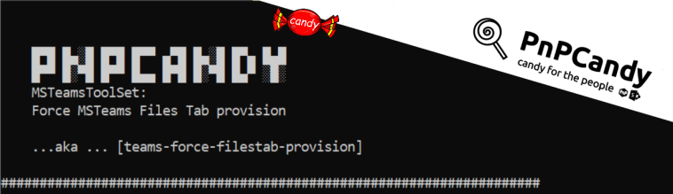

      
# Force Team Files Tab Provision

## Summary

Sometimes when we create a Team , the Files Tab is not immediately provisioned.  
  

The first time a user visit the files tab in that team's channel , an error message is shown:


This script allow us to force Files tab provision, usefull for migrations or even for your Team's governance toolset.  

The script uses Teams Native API  and is a subset of the SPO powershell packages with content (PnPCandy) concept already been used across many projects.  


Excelsior, hum? :P  

# [PnP PowerShell](#tab/pnpps)

```powershell

[CmdletBinding()]
param (
    [Parameter(Mandatory = $True)]
    [string]$Tenant ,
    [Parameter(Mandatory = $True)]
    [string]$StoredCredentials,
    [Parameter(Mandatory = $False)]
    [string]$Team
)
begin {
    $ErrorActionPreference = "Stop"
    Import-Module PnP.PowerShell   

    function Get-TeamsNativeApiTokens([PSCredential] $Credentials)
    {
        $p= [System.Runtime.InteropServices.Marshal]::PtrToStringAuto([System.Runtime.InteropServices.Marshal]::SecureStringToBSTR($Credentials.Password))
        #Get access token
        $body = @{
            "resource"   = "https://api.spaces.skype.com" # resource
            "client_id"  = "1fec8e78-bce4-4aaf-ab1b-5451cc387264" # teams web app id
            "grant_type" = "password"
            "username"   = $Credentials.UserName #username
            "password"   = $p #clearpassword
            "scope"      = "user_impersonation" #scope
        }
        $tenantId= Get-PnPTenantId
        $url = "https://login.microsoftonline.com/%7B$tenantId%7D/oauth2/token"
        $token= Invoke-RestMethod -Uri $url -Body $body -Method Post 
        
        # get Skype Token needed to access Teams Native API
        $HeadersAuth = @{
            "Authorization"   = ("Bearer " + $token.access_token)
        }
        $url = "https://authsvc.teams.microsoft.com/v1.0/authz"
        $teamsTokens= Invoke-RestMethod -Uri $url -Headers $HeadersAuth  -Method Post 

        #Build token Object
        $mainTokens= [PSCustomObject]::new()

        $mainTokens | Add-Member -Name "teamsTokens" -MemberType NoteProperty -Value $teamsTokens
        $mainTokens | Add-Member -Name "authToken" -MemberType NoteProperty -Value $token.access_token
        $mainTokens | Add-Member -Name "request" -MemberType NoteProperty -Value  ""
        $mainTokens.request = [PSCustomObject]::new()
        $mainTokens.request | Add-Member -Name "url" -MemberType NoteProperty -Value  ($teamsTokens.regionGtms.middleTier + "/beta/teams/{0}/sitestatus")
       
        $HeadersSkype = @{
            "Authorization"   = ("Bearer " + $token.access_token)
            "x-skypetoken" = $teamsTokens.tokens.skypeToken
        }
        
        $mainTokens.request | Add-Member  -Name "headersSkype" -MemberType NoteProperty -Value  $HeadersSkype
        $mainTokens.request | Add-Member  -Name "headersAuth" -MemberType NoteProperty -Value  $HeadersAuth
        $mainTokens
    }

    $msg = "`n`r

    █▀█ █▄░█ █▀█ █▀▀ ▄▀█ █▄░█ █▀▄ █▄█
    █▀▀ █░▀█ █▀▀ █▄▄ █▀█ █░▀█ █▄▀ ░█░  `n    MSTeamsToolSet: `n`r    Force MSTeams Files Tab provision    `n`n    ...aka ... [teams-force-filestab-provision]
    `n"
    $msg += ('#' * 70) + "`n"
    Write-Output  $msg
    
    ## Validate if Tenant value is ok
    if ($Tenant -notmatch '.onmicrosoft.com') {
        $msg = "Provided Tenant is not valid. Please use the following format [Tenant].onmicrosoft.com. Example:pnpcady.onmicrosoft.com"
        throw $msg
    }
    ## Validate if StoredCredentials value is ok
    $creds = Get-PnPStoredCredential -Name $StoredCredentials -ErrorAction SilentlyContinue
    if ($null -eq $creds) {
        $msg = "Provided credentials [$StoredCredentials] not found  `n`r"
        $msg += "You can use [Add-PnPStoredCredential] to adds a credential to the Windows Credential Manager `n`r"
        $msg += "Link [https://docs.microsoft.com/en-us/powershell/module/sharepoint-pnp/add-pnpstoredcredential?view=sharepoint-ps]`n`r"
        throw $msg
    }
    $tenantPrefix = $Tenant.ToLower().Replace(".onmicrosoft.com", "")
    $url = "https://$tenantPrefix.sharepoint.com"

    Write-Output "Connecting to $Url"
    Connect-PnPOnline -Url $url -Interactive -Tenant $Tenant
    $accesstoken = Get-PnPAccessToken
}
process {
    # Get Teams NativeApi Tokens
    $tokens = Get-TeamsNativeApiTokens -Credentials $creds
    
    Write-Output " Get Team(s)"
    $listOfTeams = Get-PnPMicrosoft365Group  -IncludeSiteUrl | Where-object { $_.HasTeam }

    if (($null -ne $Team) -and ($Team -ne ""))
    {
        $listOfTeams =  $listOfTeams | Where-object {($_.id -eq $Team) -or ($_.Displayname -eq $Team)}
    }
    if($null -ne $listOfTeams)
    {
        Write-Output " [$($listOfTeams.Length)] Team(s)"
    }
    else {
        Write-Output " No Team(s) found"
    }
    $Body = @{
        "Resource"      = "https://graph.microsoft.com"
    }
    $listOfTeams | ForEach-Object {
        $tm = $_
        Write-Output "  Team:$($tm.DisplayName)\$generalChannel"
        #Get Primary Channel
        $url = "https://graph.microsoft.com/v1.0/teams/$($tm.Id)/primaryChannel"  
        $primaryChannel= Invoke-RestMethod -Uri $url -Headers @{Authorization = "Bearer $accesstoken"; "Content-Type" = "application/json" } -Body $Body -Method Get 
        if ($null -ne $primaryChannel)
        {
            $generalChannel = $primaryChannel.displayName
            Write-Output "   Channel:[$generalChannel] force provision"
            $refreshFilesUrl1=  $tokens.request.url -f $primaryChannel.Id
            try{
                #Force Files Provision
                $response= Invoke-RestMethod -Uri $refreshFilesUrl1 -Headers $tokens.request.headersSkype -Body $Body -Method Get  |ConvertTo-Json
                Write-Output "   Channel:[$generalChannel] properly provisioned `n`r($response) `n`r"
            }
            catch{
                Write-Output "   Channel:[$generalChannel] couldn't be provisioned ($_) `n`r"
            }
            
        }else {
            Write-Output "   Channel:$generalChannel not found !"
        }
    }
    Disconnect-PnPOnline
    Write-Output "Disconnected"
}


```
[!INCLUDE [More about PnP PowerShell](../../docfx/includes/MORE-PNPPS.md)]
***

## Contributors

| Author(s) |
|-----------|
| Rodrigo Pinto |

[!INCLUDE [DISCLAIMER](../../docfx/includes/DISCLAIMER.md)]


