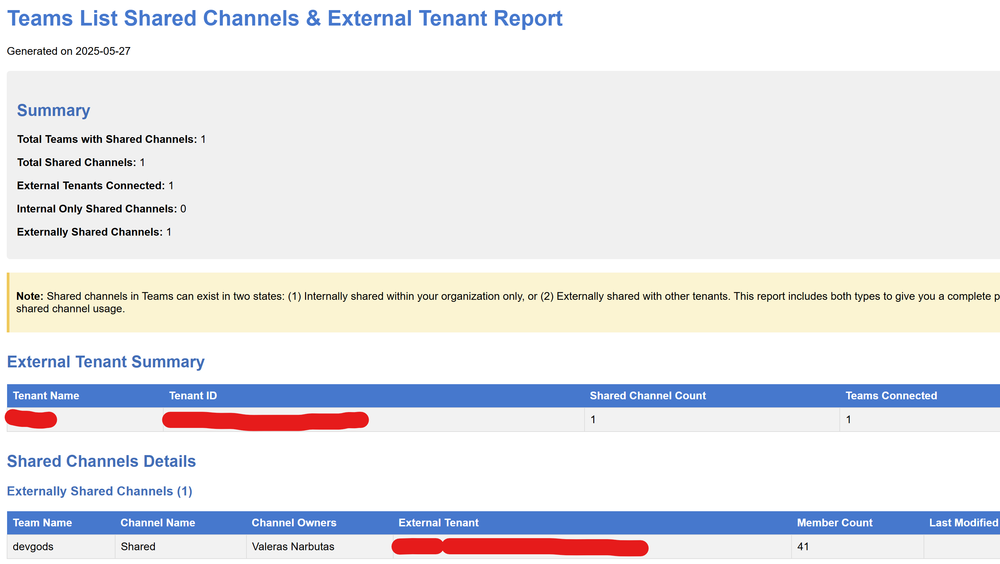

# Teams List Shared Channels & External-Tenant Detector

## Summary

This script provides a comprehensive inventory of all shared channels across Microsoft Teams in your tenant and identifies external tenant connections. As shared channels grow in popularity for cross-organization collaboration, governance tools often lag behind. This script addresses this gap by:

1. Enumerating all teams in the tenant
2. Finding all channels with membershipType = "shared"
3. Identifying which external organizations have access to these shared channels
4. Generating detailed HTML and CSV reports for governance and security review

The reports include information about team owners, shared channel owners, external tenant details, and membership counts to help administrators maintain visibility into cross-tenant collaboration.



## Prerequisites

- Microsoft Graph PowerShell SDK modules
- Permissions required:
  - Team.ReadBasic.All (to enumerate teams)
  - Channel.ReadBasic.All (to list channels)
  - ChannelSettings.Read.All (to get shared channel settings)
  - ChannelMember.Read.All (to enumerate channel members)
- PowerShell 5.1 or higher

# [Microsoft Graph PowerShell](#tab/graphps)

```powershell
#-------------------------------------------------------------------------------
# Script: Teams List Shared Channels & External-Tenant Detector
#
# Description: This script identifies all shared channels across Microsoft Teams and
# provides details about external tenant connections. It generates both HTML and CSV
# reports for governance and security review.
#
# Required permissions:
# - Team.ReadBasic.All
# - Channel.ReadBasic.All
# - ChannelSettings.Read.All
# - ChannelMember.Read.All
#-------------------------------------------------------------------------------

# Check for and install required modules
if (!(Get-Module -Name Microsoft.Graph -ListAvailable)) {
    Write-Host "Microsoft Graph PowerShell SDK not found. Installing..." -ForegroundColor Yellow
    Install-Module -Name Microsoft.Graph -Scope CurrentUser -Force
}

# Import the required Microsoft Graph modules
Import-Module Microsoft.Graph.Authentication
Import-Module Microsoft.Graph.Teams
Import-Module Microsoft.Graph.Groups
Import-Module Microsoft.Graph.Users

# Connect to Microsoft Graph with the required permissions
Connect-MgGraph -Scopes @(
    "Team.ReadBasic.All",
    "Channel.ReadBasic.All", 
    "ChannelSettings.Read.All",
    "ChannelMember.Read.All"
) -NoWelcome

# Create output directory if it doesn't exist
$outputDir = ".\TeamsSharedChannelsReport"
if (!(Test-Path -Path $outputDir)) {
    New-Item -ItemType Directory -Path $outputDir | Out-Null
}

# Get current date for report filenames
$reportDate = Get-Date -Format "yyyy-MM-dd"
$csvReportPath = Join-Path $outputDir "SharedChannelsReport_$reportDate.csv"
$htmlReportPath = Join-Path $outputDir "SharedChannelsReport_$reportDate.html"
$summaryReportPath = Join-Path $outputDir "SharedChannelsSummary_$reportDate.csv"

# Note on Shared Channels API:
# The Microsoft Graph API requires a special header "Prefer: include-unknown-enum-members"
# to properly return the "shared" membershipType value. This is because "shared" was added 
# after the API was originally designed and wasn't part of the original enum definition.
# Always include this header when working with channels to ensure shared channels are detected.

# Arrays to store data
$sharedChannelData = @()
$externalTenantSummary = @{}
$teamStats = @{}
$internalCount = 0
$externalCount = 0

Write-Host "Starting shared channel inventory..." -ForegroundColor Cyan

# Get all teams in the tenant
try {
    Write-Host "Retrieving all teams in the tenant..." -ForegroundColor Green
    $allTeams = Get-MgTeam -All
    Write-Host "Found $($allTeams.Count) teams." -ForegroundColor Green
}
catch {
    Write-Error "Error retrieving teams: $_"
    exit
}

$totalTeams = $allTeams.Count
$processedTeams = 0

foreach ($team in $allTeams) {
    $processedTeams++
    $percentComplete = [math]::Round(($processedTeams / $totalTeams) * 100, 2)
    Write-Progress -Activity "Scanning Teams for Shared Channels" -Status "Processing Team: $($team.DisplayName)" -PercentComplete $percentComplete
    try {
        # Get team owners
        $teamOwners = Get-MgGroupOwner -GroupId $team.Id
        $teamOwnerNames = ($teamOwners | ForEach-Object { $_.AdditionalProperties.displayName }) -join ", "

        # Get all channels for the team with proper headers to include unknown enum values
        # Note: We're using direct Graph API calls instead of Get-MgTeamChannel because
        # the SDK doesn't support including the "shared" membershipType without the special header
        $uri = "https://graph.microsoft.com/v1.0/teams/$($team.Id)/channels"
        $headers = @{ "Prefer" = "include-unknown-enum-members" }
        $response = Invoke-MgGraphRequest -Method GET -Uri $uri -Headers $headers
        $channels = $response.value
        
        # FIXED: Filter to only shared channels - using explicit loop instead of Where-Object
        $sharedChannels = @()
        foreach ($channel in $channels) {
            if ($channel.membershipType -eq "shared") {
                $sharedChannels += $channel
            }
        }
        
        # Debug info - list all channels and their membership types
        Write-Host "  All channels in team '$($team.DisplayName)':" -ForegroundColor DarkGray
        foreach ($ch in $channels) {
            Write-Host "    - $($ch.DisplayName) (Type: $($ch.membershipType))" -ForegroundColor DarkGray
        }
        
        if ($sharedChannels -and $sharedChannels.Count -gt 0) {
            Write-Host "  Found $($sharedChannels.Count) shared channel(s) in team '$($team.DisplayName)'" -ForegroundColor Yellow
            
            foreach ($sharedChannel in $sharedChannels) {
                Write-Host "    Processing shared channel: $($sharedChannel.DisplayName)" -ForegroundColor Green
                try {                    
                    # Get channel members
                    try {
                        $channelMembers = Get-MgTeamChannelMember -TeamId $team.Id -ChannelId $sharedChannel.Id
                        $channelMemberCount = $channelMembers.Count
                        
                        # Get channel owners
                        $channelOwners = $channelMembers | Where-Object { $_.Roles -contains "owner" }
                        $channelOwnerNames = ($channelOwners | ForEach-Object { $_.DisplayName }) -join ", "
                    }
                    catch {
                        Write-Warning "    Error retrieving channel members for $($sharedChannel.DisplayName): $_"
                        $channelMemberCount = 0
                        $channelOwnerNames = "Unknown (access error)"
                    }
                    
                    # Get all organizations the channel is shared with
                    # Must use direct API call with the special header to get external tenant information
                    $uri = "https://graph.microsoft.com/v1.0/teams/$($team.Id)/channels/$($sharedChannel.Id)/sharedWithTeams"
                    $headers = @{ "Prefer" = "include-unknown-enum-members" }

                    $sharedWithOrgs = Invoke-MgGraphRequest -Method GET -Uri $uri -Headers $headers

                    if ($null -eq $sharedWithOrgs.value -or $sharedWithOrgs.value.Count -eq 0) {
                        Write-Host "    Channel '$($sharedChannel.DisplayName)' is a shared channel but has no external tenant connections" -ForegroundColor Magenta
                        $internalCount++
                        
                        # Still add the channel to the report as an internal shared channel
                        $sharedChannelData += [PSCustomObject]@{
                            TeamId = $team.Id
                            TeamName = $team.DisplayName
                            TeamOwners = $teamOwnerNames
                            ChannelId = $sharedChannel.Id
                            ChannelName = $sharedChannel.DisplayName
                            ChannelDescription = $sharedChannel.Description
                            ChannelOwners = $channelOwnerNames
                            MemberCount = $channelMemberCount
                            TenantId = "Internal"
                            TenantName = "Internal (No external sharing)"
                            LastModifiedDateTime = $sharedChannel.ModifiedDateTime
                        }
                        
                        # Update team stats for internal shared channels
                        if (-not $teamStats.ContainsKey($team.Id)) {
                            $teamStats[$team.Id] = @{
                                "TeamName" = $team.DisplayName
                                "TotalSharedChannels" = 0
                                "ExternalTenants" = @{}
                            }
                        }
                        
                        $teamStats[$team.Id]["TotalSharedChannels"]++
                    }
                    else {
                        Write-Host "    Channel '$($sharedChannel.DisplayName)' is shared with $($sharedWithOrgs.value.Count) external tenant(s)" -ForegroundColor Cyan
                        $externalCount++
                        
                        # Process each external tenant
                        foreach ($org in $sharedWithOrgs.value) {
                            # Extract tenant information
                            $tenantId = $org.tenantId
                            $tenantName = $org.displayName
                            
                            # Update external tenant summary
                            if (-not $externalTenantSummary.ContainsKey($tenantId)) {
                                $externalTenantSummary[$tenantId] = @{
                                    "TenantName" = $tenantName
                                    "ChannelCount" = 0
                                    "Teams" = @{}
                                    "TotalExternalMembers" = 0
                                }
                            }
                            
                            $externalTenantSummary[$tenantId]["ChannelCount"]++
                            
                            if (-not $externalTenantSummary[$tenantId]["Teams"].ContainsKey($team.Id)) {
                                $externalTenantSummary[$tenantId]["Teams"][$team.Id] = @{
                                    "TeamName" = $team.DisplayName
                                    "Channels" = @()
                                }
                            }
                            
                            $externalTenantSummary[$tenantId]["Teams"][$team.Id]["Channels"] += $sharedChannel.DisplayName
                            
                            # Add to main data collection
                            $sharedChannelData += [PSCustomObject]@{
                                TeamId = $team.Id
                                TeamName = $team.DisplayName
                                TeamOwners = $teamOwnerNames
                                ChannelId = $sharedChannel.Id
                                ChannelName = $sharedChannel.DisplayName
                                ChannelDescription = $sharedChannel.Description
                                ChannelOwners = $channelOwnerNames
                                MemberCount = $channelMemberCount
                                TenantId = $tenantId
                                TenantName = $tenantName
                                LastModifiedDateTime = $sharedChannel.ModifiedDateTime
                            }
                        }
                        
                        # Update team stats
                        if (-not $teamStats.ContainsKey($team.Id)) {
                            $teamStats[$team.Id] = @{
                                "TeamName" = $team.DisplayName
                                "TotalSharedChannels" = 0
                                "ExternalTenants" = @{}
                            }
                        }
                        
                        $teamStats[$team.Id]["TotalSharedChannels"]++
                        
                        foreach ($org in $sharedWithOrgs.value) {
                            $tenantId = $org.tenantId
                            if (-not $teamStats[$team.Id]["ExternalTenants"].ContainsKey($tenantId)) {
                                $teamStats[$team.Id]["ExternalTenants"][$tenantId] = $org.displayName
                            }
                        }
                    }
                }
                catch {
                    Write-Warning "Error processing shared channel $($sharedChannel.DisplayName): $_"
                }
            }
        }
    }
    catch {
        Write-Warning "Error processing team $($team.DisplayName): $_"
    }
}

Write-Progress -Activity "Scanning Teams for Shared Channels" -Status "Complete" -Completed

Write-Host "Summary:" -ForegroundColor Green
Write-Host "  Total shared channels: $($internalCount + $externalCount)" -ForegroundColor Green
Write-Host "  Internal only shared channels: $internalCount" -ForegroundColor Green
Write-Host "  Externally shared channels: $externalCount" -ForegroundColor Green

# Generate CSV report
if ($sharedChannelData.Count -gt 0) {
    $sharedChannelData | Export-Csv -Path $csvReportPath -NoTypeInformation
    Write-Host "CSV report exported to: $csvReportPath" -ForegroundColor Green
}
else {
    Write-Host "No shared channels found in the tenant." -ForegroundColor Yellow
}

# Generate tenant summary report
$tenantSummaryData = @()
foreach ($tenantId in $externalTenantSummary.Keys) {
    $tenantInfo = $externalTenantSummary[$tenantId]
    $teamCount = $tenantInfo["Teams"].Count
    
    $tenantSummaryData += [PSCustomObject]@{
        TenantId = $tenantId
        TenantName = $tenantInfo["TenantName"]
        SharedChannelCount = $tenantInfo["ChannelCount"]
        TeamCount = $teamCount
        Teams = ($tenantInfo["Teams"].Values | ForEach-Object { $_.TeamName }) -join ", "
    }
}

$tenantSummaryData | Export-Csv -Path $summaryReportPath -NoTypeInformation
Write-Host "Tenant summary report exported to: $summaryReportPath" -ForegroundColor Green

# Generate HTML report
$htmlHeader = @"
<!DOCTYPE html>
<html>
<head>
    <title>Teams Shared Channels Report - $reportDate</title>
    <style>
        body { font-family: Arial, sans-serif; margin: 20px; }
        h1 { color: #0078d4; }
        h2 { color: #106ebe; margin-top: 30px; }
        h3 { color: #106ebe; margin-top: 20px; }
        table { border-collapse: collapse; width: 100%; margin-top: 10px; margin-bottom: 30px; }
        th { background-color: #0078d4; color: white; text-align: left; padding: 8px; }
        td { border: 1px solid #ddd; padding: 8px; }
        tr:nth-child(even) { background-color: #f2f2f2; }
        tr:hover { background-color: #e6f2ff; }
        .summary { background-color: #f0f0f0; padding: 15px; border-radius: 5px; margin: 20px 0; }
        .warning { color: #d83b01; }
        .info { color: #0078d4; }
        .note { background-color: #FFF4CE; padding: 10px; border-left: 4px solid #FFC83D; margin: 15px 0; }
    </style>
</head>
<body>
    <h1>Teams List Shared Channels & External Tenant Report</h1>
    <p>Generated on $reportDate</p>
    
    <div class="summary">
        <h2>Summary</h2>
        <p><b>Total Teams with Shared Channels:</b> $($teamStats.Count)</p>
        <p><b>Total Shared Channels:</b> $($internalCount + $externalCount)</p>
        <p><b>External Tenants Connected:</b> $($externalTenantSummary.Count)</p>
        <p><b>Internal Only Shared Channels:</b> $internalCount</p>
        <p><b>Externally Shared Channels:</b> $externalCount</p>
    </div>
    
    <div class="note">
        <p><b>Note:</b> Shared channels in Teams can exist in two states: (1) Internally shared within your organization only, or (2) Externally shared with other tenants. This report includes both types to give you a complete picture of shared channel usage.</p>
    </div>
"@

$externalTenantHtml = @"
    <h2>External Tenant Summary</h2>
    <table>
        <tr>
            <th>Tenant Name</th>
            <th>Tenant ID</th>
            <th>Shared Channel Count</th>
            <th>Teams Connected</th>
        </tr>
"@

foreach ($tenant in $tenantSummaryData | Sort-Object -Property SharedChannelCount -Descending) {
    $externalTenantHtml += @"
        <tr>
            <td>$($tenant.TenantName)</td>
            <td>$($tenant.TenantId)</td>
            <td>$($tenant.SharedChannelCount)</td>
            <td>$($tenant.TeamCount)</td>
        </tr>
"@
}

$externalTenantHtml += @"
    </table>
"@

$externalSharedChannels = $sharedChannelData | Where-Object { $_.TenantId -ne "Internal" }
$internalSharedChannels = $sharedChannelData | Where-Object { $_.TenantId -eq "Internal" }

$sharedChannelsHtml = @"
    <h2>Shared Channels Details</h2>
"@

# External Shared Channels
if ($externalSharedChannels.Count -gt 0) {
    $sharedChannelsHtml += @"
    <h3>Externally Shared Channels ($($externalSharedChannels.Count))</h3>
    <table>
        <tr>
            <th>Team Name</th>
            <th>Channel Name</th>
            <th>Channel Owners</th>
            <th>External Tenant</th>
            <th>Member Count</th>
            <th>Last Modified</th>
        </tr>
"@

    foreach ($channel in $externalSharedChannels | Sort-Object -Property TeamName, ChannelName) {
        $sharedChannelsHtml += @"
        <tr>
            <td>$($channel.TeamName)</td>
            <td>$($channel.ChannelName)</td>
            <td>$($channel.ChannelOwners)</td>
            <td>$($channel.TenantName) ($($channel.TenantId))</td>
            <td>$($channel.MemberCount)</td>
            <td>$($channel.LastModifiedDateTime)</td>
        </tr>
"@
    }
    
    $sharedChannelsHtml += @"
    </table>
"@
}

# Internal Shared Channels
if ($internalSharedChannels.Count -gt 0) {
    $sharedChannelsHtml += @"
    <h3>Internal Only Shared Channels ($($internalSharedChannels.Count))</h3>
    <table>
        <tr>
            <th>Team Name</th>
            <th>Channel Name</th>
            <th>Channel Owners</th>
            <th>Sharing Status</th>
            <th>Member Count</th>
            <th>Last Modified</th>
        </tr>
"@

    foreach ($channel in $internalSharedChannels | Sort-Object -Property TeamName, ChannelName) {
        $sharedChannelsHtml += @"
        <tr>
            <td>$($channel.TeamName)</td>
            <td>$($channel.ChannelName)</td>
            <td>$($channel.ChannelOwners)</td>
            <td>Internal sharing only (not shared with external tenants)</td>
            <td>$($channel.MemberCount)</td>
            <td>$($channel.LastModifiedDateTime)</td>
        </tr>
"@
    }
    
    $sharedChannelsHtml += @"
    </table>
"@
}

$htmlFooter = @"
    <h2>Recommendations</h2>
    <ul>
        <li>Review shared channels to ensure they comply with your external sharing policies</li>
        <li>Verify that channel owners are monitoring external user activity</li>
        <li>When working with shared channels via Graph API, always use the "Prefer: include-unknown-enum-members" header</li>
        <li>Consider implementing regular audits of external sharing via shared channels</li>
        <li>Ensure proper data governance and DLP policies are applied to teams with shared channels</li>
    </ul>

    <p><i>Report generated using the Teams List Shared Channels & External-Tenant Detector script.</i></p>
</body>
</html>
"@

$fullHtml = $htmlHeader + $externalTenantHtml + $sharedChannelsHtml + $htmlFooter
$fullHtml | Out-File -FilePath $htmlReportPath -Encoding UTF8

Write-Host "HTML report exported to: $htmlReportPath" -ForegroundColor Green
Write-Host "Teams List Shared Channels completed!" -ForegroundColor Cyan

# Disconnect from Microsoft Graph
Disconnect-MgGraph | Out-Null
Write-Host "Disconnected from Microsoft Graph." -ForegroundColor Green
```
[!INCLUDE [More about Microsoft Graph PowerShell SDK](../../docfx/includes/MORE-GRAPHSDK.md)]
***


## Contributors

| Author(s) |
|-----------|
| [Valeras Narbutas](https://github.com/ValerasNarbutas) |

## Additional Information

### Key Microsoft Graph API Endpoints Used

1. List all teams in the tenant:
   - `GET /teams` via Get-MgTeam

2. Get channels in a team:
   - `GET /teams/{team-id}/channels` with `Prefer: include-unknown-enum-members` header
   - This special header is required to properly retrieve the "shared" membershipType

3. List shared channel details:
   - `GET /teams/{team-id}/channels/{channel-id}/sharedWithTeams` with `Prefer: include-unknown-enum-members` header

4. Get channel members:
   - `GET /teams/{team-id}/channels/{channel-id}/members` via Get-MgTeamChannelMember

### Report Types Generated

This script generates three report files:

1. **Detailed CSV Report** - A complete inventory of all shared channels with external connections
2. **HTML Dashboard** - Visual representation with summary statistics and detailed tables
3. **Tenant Summary CSV** - Aggregated view of external tenants and their connections

### Example Usage

**Basic Usage:**
```powershell
./Teams-List-Shared-Channels.ps1
```

This will:
- Authenticate to Microsoft Graph
- Scan all teams for shared channels
- Generate reports in the ./TeamsSharedChannelsReport folder

### Security Considerations

- The script requires significant permissions to read team and channel information
- Consider running this script as part of a regular security audit process
- Review the generated reports to identify potential external sharing risks

[!INCLUDE [DISCLAIMER](../../docfx/includes/DISCLAIMER.md)]

