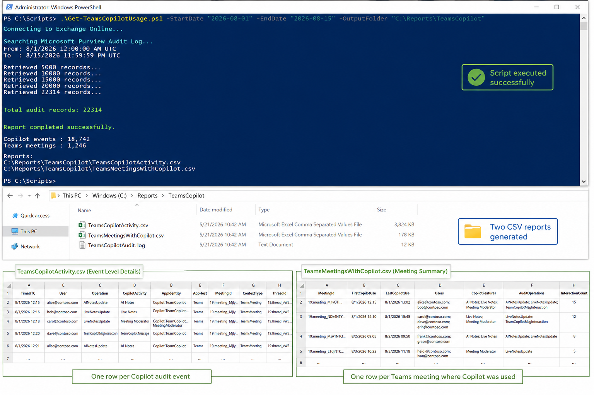

# Teams Meetings With Copilot Usage

## Summary

This script provides a solution for identifying Microsoft Teams meetings where Copilot or Facilitator capabilities were used by analyzing Microsoft Purview Unified Audit Logs. It searches for the Copilot-related audit events **AINotesUpdate**, **LiveNotesUpdate**, and **TeamCopilotMsgInteraction**, parses the audit data, and correlates the activity with Teams meeting identifiers and users.

The script follows these steps:

1. **Connects** to Exchange Online and Microsoft Purview audit logging
2. **Defines the date range** for the audit log search
3. **Searches Unified Audit Logs** for `AINotesUpdate`, `LiveNotesUpdate`, and `TeamCopilotMsgInteraction`
4. **Handles audit log pagination** to retrieve larger result sets
5. **Parses AuditData** from each Copilot-related event
6. **Identifies Copilot activity** such as AI Notes, Live Notes, Meeting Moderator, and Team Copilot messages
7. **Extracts Teams meeting information** including Meeting ID, Thread ID, user, timestamp, and application context
8. **Correlates multiple Copilot events** belonging to the same Teams meeting
9. **Generates a detailed activity report** containing individual Copilot interactions
10. **Generates a consolidated meeting report** showing unique Teams meetings where Copilot was used, including users, Copilot features used, first and last usage time, and interaction count
11. **Exports the results to CSV files** for further analysis and reporting



## Output Files

The script generates two CSV files for analyzing Microsoft Teams Copilot usage.

### 1. TeamsCopilotActivity.csv

This file provides a **detailed event-level report** of Copilot activity captured from the Microsoft Purview Unified Audit Log. Each row represents an individual Copilot-related audit event.

The report includes information such as:

| Parameter           | Description                                                                                                                         |
| ------------------- | ----------------------------------------------------------------------------------------------------------------------------------- |
| **TimeUTC**         | Date and time when the Copilot activity occurred, recorded in UTC.                                                                  |
| **User**            | User associated with the Copilot audit event.                                                                                       |
| **Operation**       | Audit operation captured, such as `AINotesUpdate`, `LiveNotesUpdate`, or `TeamCopilotMsgInteraction`.                               |
| **CopilotActivity** | User-friendly description of the Copilot capability used, such as AI Notes, Live Notes, Meeting Moderator, or Team Copilot Message. |
| **AppIdentity**     | Identifies the specific Copilot application or capability responsible for the event.                                                |
| **AppHost**         | Microsoft 365 application where the Copilot activity occurred, typically Teams.                                                     |
| **MeetingId**       | Identifier used to associate the Copilot activity with a Teams meeting.                                                             |
| **ContextType**     | Type of Copilot context associated with the event, such as `TeamsMeeting`.                                                          |
| **ThreadId**        | Teams conversation or meeting thread identifier associated with the activity.                                                       |
| **RecordType**      | Microsoft Purview audit record type for the event.                                                                                  |
| **AuditRecordId**   | Unique identifier of the Microsoft Purview audit record.                                                                            |
| **ClientIP**        | Client IP address recorded for the audit activity, when available.                                                                  |
| **ClientRegion**    | Geographic/client region associated with the audit event, when available.                                                           |


This file is useful for **detailed investigation, auditing, and understanding individual Copilot interactions** within Teams meetings.

### 2. TeamsMeetingsWithCopilot.csv

This file provides a **consolidated meeting-level report**. Multiple Copilot audit events associated with the same Meeting ID are grouped into a single record.

The report includes:

| Parameter            | Description                                                                                                                    |
| -------------------- | ------------------------------------------------------------------------------------------------------------------------------ |
| **MeetingId**        | Unique identifier of the Teams meeting where Copilot activity was detected.                                                    |
| **FirstCopilotUse**  | Timestamp of the first Copilot-related activity detected for the meeting.                                                      |
| **LastCopilotUse**   | Timestamp of the last Copilot-related activity detected for the meeting.                                                       |
| **Users**            | List of unique users associated with Copilot activities in the meeting.                                                        |
| **CopilotFeatures**  | Copilot capabilities detected during the meeting, such as AI Notes, Live Notes, Meeting Moderator, or Team Copilot Message.    |
| **AuditOperations**  | Unique audit operations detected for the meeting, such as `AINotesUpdate`, `LiveNotesUpdate`, and `TeamCopilotMsgInteraction`. |
| **InteractionCount** | Total number of Copilot-related audit events detected for the meeting.                                                         |

This file is useful for **reporting and adoption analysis**, as it provides a quick view of which Teams meetings used Copilot and how Copilot was used during those meetings.


## Permissions

The account running the script must have sufficient permissions to search the Microsoft Purview Unified Audit Log and retrieve Copilot-related audit events.

The following permissions and roles are required:

* **Microsoft Purview Audit permissions** – The user must be assigned the **Audit Reader** or **Audit Manager** role in Microsoft Purview to search and retrieve audit records.
* **Exchange Online access** – The script uses the **ExchangeOnlineManagement** PowerShell module and `Search-UnifiedAuditLog` cmdlet. The signed-in account must be authorized to run audit log searches.
* **Audit logging enabled** – Microsoft Purview auditing must be enabled for the tenant so that Teams and Copilot activities are recorded.
* **Copilot/Teams audit data access** – The account must have permission to retrieve the relevant audit operations, including `AINotesUpdate`, `LiveNotesUpdate`, and `TeamCopilotMsgInteraction`.

For least-privilege access, assigning the user to the **Audit Reader** role group is generally sufficient when the requirement is only to retrieve and analyze audit events without modifying audit configuration.

## Implementation

- Open Windows PowerShell ISE
- Create a new file
- Copy the code below
- Save the file and run it

# [PowerShell](#tab/ps)

```powershell
<#
.SYNOPSIS
    Reports on Microsoft Teams meetings where Copilot or Facilitator was used.

.DESCRIPTION
    Searches the Microsoft 365 Unified Audit Log for Copilot-related Teams events
    (AI Notes, Live Notes, Meeting Moderator, and Team Copilot messages) and produces
    two CSV reports: a detailed per-event report and a summary per-meeting report.

.PARAMETER StartDate
    Start of the audit log search window. Defaults to 30 days ago.

.PARAMETER EndDate
    End of the audit log search window. Defaults to now.

.PARAMETER OutputFolder
    Folder to write the CSV reports to. Defaults to the current directory.

.NOTES
    Requires the ExchangeOnlineManagement module and Exchange Online audit log permissions.

.EXAMPLE
    .\Get-TeamsMeetingsWithCopilot.ps1 -StartDate (Get-Date).AddDays(-7) -OutputFolder "C:\Reports"
#>

[CmdletBinding()]
param (
    [datetime]$StartDate = (Get-Date).AddDays(-30),
    [datetime]$EndDate = (Get-Date),
    [string]$OutputFolder = "."
)

Import-Module ExchangeOnlineManagement
Connect-ExchangeOnline

# Unified Audit Log timestamps are stored in UTC.
$StartDateUtc = $StartDate.ToUniversalTime()
$EndDateUtc = $EndDate.ToUniversalTime()

Write-Host "Searching audit log from $StartDateUtc to $EndDateUtc (UTC)..." -ForegroundColor Cyan

$Operations = @(
    "AINotesUpdate",
    "LiveNotesUpdate",
    "TeamCopilotMsgInteraction"
)

# Search-UnifiedAuditLog paginates results; ReturnLargeSet supports up to 50,000 records per session.
$SessionId = "TeamsCopilot-$([guid]::NewGuid())"
$AuditRecords = @()

do {
    $Results = Search-UnifiedAuditLog -StartDate $StartDateUtc -EndDate $EndDateUtc `
        -Operations $Operations -SessionId $SessionId -SessionCommand ReturnLargeSet -ResultSize 5000

    if ($Results) {
        $AuditRecords += $Results
        Write-Host "Retrieved $($AuditRecords.Count) audit records..." -ForegroundColor Yellow
    }
}
while ($Results.Count -gt 0)

Write-Host "Total audit records found: $($AuditRecords.Count)" -ForegroundColor Green

$DetailedResults = foreach ($Record in $AuditRecords) {
    try {
        $AuditData = $Record.AuditData | ConvertFrom-Json
        $CopilotEventData = $AuditData.CopilotEventData

        $AppHost = $null
        $ThreadId = $null
        $Contexts = $null

        if ($CopilotEventData) {
            $AppHost = $CopilotEventData.AppHost
            $ThreadId = $CopilotEventData.ThreadId
            $Contexts = $CopilotEventData.Contexts
        }

        # Expected values: Copilot.TeamCopilot.AINotes, LiveNotes, MeetingModerator, Message
        $AppIdentity = $null

        if ($AuditData.AppIdentity) {
            $AppIdentity = $AuditData.AppIdentity
        }
        elseif ($CopilotEventData.AppIdentity) {
            $AppIdentity = $CopilotEventData.AppIdentity
        }

        $MeetingContext = $Contexts | Where-Object { $_.Type -eq "TeamsMeeting" } | Select-Object -First 1

        $MeetingId = $null
        $ContextType = $null

        if ($MeetingContext) {
            $MeetingId = $MeetingContext.Id
            $ContextType = $MeetingContext.Type
        }

        # Fall back to alternate properties if no Teams meeting context was found.
        if (-not $MeetingId) {
            if ($AuditData.MeetingId) {
                $MeetingId = $AuditData.MeetingId
            }
            elseif ($AuditData.ThreadId) {
                $MeetingId = $AuditData.ThreadId
            }
            elseif ($ThreadId) {
                $MeetingId = $ThreadId
            }
        }

        $CopilotActivity = switch ($AuditData.Operation) {
            "AINotesUpdate" { "AI Notes" }
            "LiveNotesUpdate" {
                if ($AppIdentity -match "MeetingModerator") { "Meeting Moderator" } else { "Live Notes" }
            }
            "TeamCopilotMsgInteraction" { "Team Copilot Message" }
            default { $AuditData.Operation }
        }

        [PSCustomObject]@{
            TimeUTC         = $AuditData.CreationTime
            User            = $AuditData.UserId
            Operation       = $AuditData.Operation
            CopilotActivity = $CopilotActivity
            AppIdentity     = $AppIdentity
            AppHost         = $AppHost
            MeetingId       = $MeetingId
            ContextType     = $ContextType
            ThreadId        = $ThreadId
            RecordType      = $AuditData.RecordType
            AuditRecordId   = $AuditData.Id
            ClientIP        = $AuditData.ClientIP
            ClientRegion    = $AuditData.ClientRegion
        }
    }
    catch {
        Write-Warning "Unable to parse audit record $($Record.Identity)"
    }
}

$DetailedFile = Join-Path $OutputFolder "TeamsCopilotActivity.csv"
$DetailedResults | Sort-Object TimeUTC | Export-Csv -Path $DetailedFile -NoTypeInformation -Encoding UTF8

$MeetingResults = $DetailedResults | Where-Object { $_.MeetingId } | Group-Object MeetingId | ForEach-Object {
    $MeetingEvents = $_.Group | Sort-Object TimeUTC

    $Users = ($MeetingEvents.User | Where-Object { $_ } | Sort-Object -Unique) -join "; "
    $Activities = ($MeetingEvents.CopilotActivity | Where-Object { $_ } | Sort-Object -Unique) -join "; "
    $OperationsUsed = ($MeetingEvents.Operation | Sort-Object -Unique) -join "; "

    [PSCustomObject]@{
        MeetingId         = $_.Name
        FirstCopilotUse   = $MeetingEvents[0].TimeUTC
        LastCopilotUse    = $MeetingEvents[-1].TimeUTC
        Users             = $Users
        CopilotFeatures   = $Activities
        AuditOperations   = $OperationsUsed
        InteractionCount  = $MeetingEvents.Count
    }
}

$MeetingFile = Join-Path $OutputFolder "TeamsMeetingsWithCopilot.csv"
$MeetingResults | Sort-Object FirstCopilotUse | Export-Csv -Path $MeetingFile -NoTypeInformation -Encoding UTF8

Write-Host ""
Write-Host "============================================" -ForegroundColor Cyan
Write-Host "Copilot audit events : $($DetailedResults.Count)"
Write-Host "Meetings found       : $($MeetingResults.Count)"
Write-Host ""
Write-Host "Detailed report: $DetailedFile" -ForegroundColor Green
Write-Host "Meeting report : $MeetingFile" -ForegroundColor Green
Write-Host "============================================" -ForegroundColor Cyan

Disconnect-ExchangeOnline -Confirm:$false
```
[!INCLUDE [More about PowerShell](../../docfx/includes/MORE-PS.md)]

## Contributors

| Author(s) |
|-----------|
| [Nanddeep Nachan](https://github.com/nanddeepn) |
| [Smita Nachan](https://github.com/SmitaNachan) |

## References

[!INCLUDE [DISCLAIMER](../../docfx/includes/DISCLAIMER.md)]

