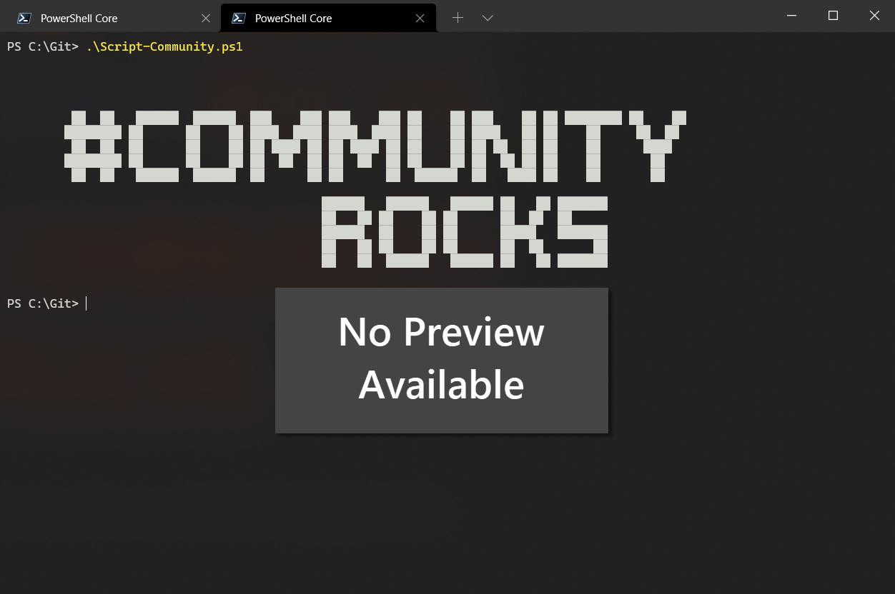

# <title>

> [!Note]
> This is a submission helper template please find the [contributor guidance](/docfx/contribute.md) to help you write this scenario.

## Summary

Lorem ipsum dolor sit amet, consectetuer adipiscing elit. Maecenas porttitor congue massa. Fusce posuere, magna sed pulvinar ultricies, purus lectus malesuada libero, sit amet commodo magna eros quis urna.



Lorem ipsum dolor sit amet, consectetuer adipiscing elit. Maecenas porttitor congue massa. Fusce posuere, magna sed pulvinar ultricies, purus lectus malesuada libero, sit amet commodo magna eros quis urna.Nunc viverra imperdiet enim. Fusce est. Vivamus a tellus.Pellentesque habitant morbi tristique senectus et netus et malesuada fames ac turpis egestas. Proin pharetra nonummy pede. Mauris et orci.Aenean nec lorem. In porttitor. Donec laoreet nonummy augue.


# [PnP PowerShell](#tab/pnpps)

```powershell

<your powershell script>

```
[!INCLUDE [More about PnP PowerShell](../../docfx/includes/MORE-PNPPS.md)]

# [CLI for Microsoft 365](#tab/cli-m365)

```powershell

<your powershell script>

```
[!INCLUDE [More about CLI for Microsoft 365](../../docfx/includes/MORE-CLIM365.md)]

# [Microsoft Graph PowerShell](#tab/graphps)

```powershell

<your powershell script>

```
[!INCLUDE [More about Microsoft Graph PowerShell SDK](../../docfx/includes/MORE-GRAPHSDK.md)]

***

## Source Credit

Sample first appeared on [https://pnp.github.io/cli-microsoft365/sample-scripts/spo/add-app-catalog/](https://pnp.github.io/cli-microsoft365/sample-scripts/spo/add-app-catalog/)

## Contributors

| Author(s) |
|-----------|
| <-you-> |


[!INCLUDE [DISCLAIMER](../../docfx/includes/DISCLAIMER.md)]
