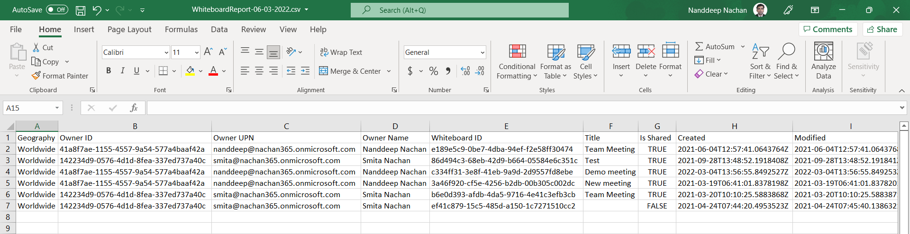

     
# Export a csv report on all Whiteboards

## Summary

Export a report on all Whiteboard owners and it's usage.
This script allow us to export a list of all Whiteboards created in our tenant and it's owner.

> [!Warning]
> The data returned is precalculated and therefore not realtime. Results are precalculated approximately every two weeks.

The script exports Geography, Owner ID, Owner UPN, Owner Name, Whiteboard ID, Title, Is Shared, Created, Modified as follows.



## Prerequisites

This script uses [WhiteboardAdmin](https://www.powershellgallery.com/packages/WhiteboardAdmin/) PowerShell module.

Install the module by running below cmdlet.

```powershell
Install-Module -Name WhiteboardAdmin
```

You may need to update your execution policy by running below cmdlet.

```powershell
Set-ExecutionPolicy RemoteSigned
```

To get the owner details, this script uses [Microsoft Graph](https://www.powershellgallery.com/packages/Microsoft.Graph/) PowerShell module.

```powershell
Install-Module -Name Microsoft.Graph
```

# [Microsoft Whiteboard Admin](#tab/whiteboard)

```powershell
# Import modules
Import-Module WhiteboardAdmin
Import-Module Microsoft.Graph.Users

$dateTime = (Get-Date).toString("dd-MM-yyyy")
$invocation = (Get-Variable MyInvocation).Value
$directoryPath = Split-Path $invocation.MyCommand.Path
$fileName = "WhiteboardReport-" + $dateTime + ".csv"
$logFileName = "WhiteboardReport-" + $dateTime + ".log"
$outputView = $directoryPath + "\" + $fileName
Start-Transcript -Path ".\$logFileName"

try {
	# Connect to Azure AD
	$Msolcred = Get-credential
	Connect-MgGraph -Scopes "User.Read.All"

	# The geography to look for board owners in. Accepted values are: Europe, Australia, or Worldwide (all boards not in australia or europe).
	$supportedGeographies = @("Europe", "Australia", "Worldwide")
	
	# Array to hold Whiteboard owners
	$whiteboardOwners = @()
	
	foreach ($geography in $supportedGeographies) {
		Write-Host "`nGetting Whiteboard owners for geography: $($geography) ..."
		$geographyOwners = Get-WhiteboardOwners -Geography $geography		
		
		foreach ($geographyOwner in $geographyOwners.items) {			
			$exportOwner = New-Object PSObject
			$exportOwner | Add-Member -MemberType NoteProperty -name "Geography" -value $geography
			$exportOwner | Add-Member -MemberType NoteProperty -name "OwnerID" -value $geographyOwner
			
			try {
				$ownerInfo = Get-MgUser -UserId $geographyOwner -ErrorAction Stop
				if ($ownerInfo) {
					$exportOwner | Add-Member -MemberType NoteProperty -name "OwnerUPN" -value $ownerInfo.UserPrincipalName
					$exportOwner | Add-Member -MemberType NoteProperty -name "OwnerDisplayName" -value $ownerInfo.DisplayName
				}
			}
			catch {
				write-host -f Red "Error:" $_.Exception.Message
			}
				
			$whiteboardOwners += $exportOwner
		}
		
		Write-Host "Found $($geographyOwners.items.Count) Whiteboard owners."
	}
	
	# Array to hold Whiteboard details
	$whiteboards = @()
	
	# Get whiteboards from the Microsoft Whiteboard service by owners
	foreach ($whiteboardOwner in $whiteboardOwners) {
		Write-Host "`nGetting Whiteboards for owner: $($whiteboardOwner.OwnerUPN) ..."

		$retryCount = 0
		$maxRetries = 3
		$pauseDuration = 2
		$processed = $false
		
		while ($processed -ne $true){
			try {
				$whiteboardInfo = Get-Whiteboard -UserId $whiteboardOwner.OwnerID
				
				foreach ($whiteboardInstance in $whiteboardInfo) {
					$exportWhiteboard = New-Object PSObject
					$exportWhiteboard | Add-Member -MemberType NoteProperty -name "Geography" -value $whiteboardOwner.Geography
					$exportWhiteboard | Add-Member -MemberType NoteProperty -name "Owner ID" -value $whiteboardOwner.OwnerID
					$exportWhiteboard | Add-Member -MemberType NoteProperty -name "Owner UPN" -value $whiteboardOwner.OwnerUPN
					$exportWhiteboard | Add-Member -MemberType NoteProperty -name "Owner Name" -value $whiteboardOwner.OwnerDisplayName
					$exportWhiteboard | Add-Member -MemberType NoteProperty -name "Whiteboard ID" -value $whiteboardInstance.id
					$exportWhiteboard | Add-Member -MemberType NoteProperty -name "Title" -value $whiteboardInstance.title
					$exportWhiteboard | Add-Member -MemberType NoteProperty -name "Is Shared" -value $whiteboardInstance.isShared
					$exportWhiteboard | Add-Member -MemberType NoteProperty -name "Created" -value $whiteboardInstance.createdTime
					$exportWhiteboard | Add-Member -MemberType NoteProperty -name "Modified" -value $whiteboardInstance.lastModifiedTime
					
					$whiteboards += $exportWhiteboard
				}
				
				Write-Host "Found $($whiteboardInfo.Count) Whiteboards owned by: $($whiteboardOwner.OwnerUPN)"
				$processed = $true
			} 
			catch {
				if ($retryCount -ge $maxRetries){
					# not going to retry again
					$processed = $true
					Write-Host 'Not going to retry...'
				} 
				else {
					$retryCount += 1
					Write-Host "Retry attempt $retryCount after a $pauseDuration second pause..."
					Start-Sleep -Seconds $pauseDuration
				}
			}
		}
	}
	
	Write-Host "`nFound $($whiteboards.Count) Whiteboards in a tenant."

	# Export the result Array to CSV file
	$whiteboards | sort "Geography" | Export-CSV -Path $outputView -Force -NoTypeInformation
	
	Write-Host "`nFinished"
}
catch {
    Write-Host -f Red "Error:" $_.Exception.Message
}
finally {
	Stop-Transcript
}
```
[!INCLUDE [More about Microsoft Whiteboard Admin](../../docfx/includes/MORE-WHITEBOARD.md)]
***

## Contributors

| Author(s) |
|-----------|
| Nanddeep Nachan |
| Smita Nachan |

# Alternative approach

[Reporting Whiteboards with PowerShell with Graph PowerShell - Whiteboard Nears End of Transition to OneDrive | Office IT Pros ](https://office365itpros.com/2022/03/10/whiteboard-transition-ending/)

[!INCLUDE [DISCLAIMER](../../docfx/includes/DISCLAIMER.md)]

